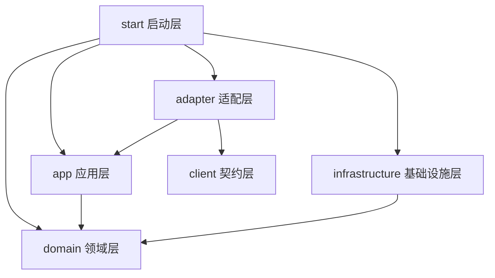

# ARCHITECTURE.md

## 系统概述

valhalla-auth 是英灵殿（Valhalla）平台的认证微服务，负责用户身份验证、JWT Token 生命周期管理和账户安全策略。服务面向平台内所有需要身份认证的客户端（Web、Mobile、WAP）以及内部微服务（通过 Dubbo RPC）。

技术选型：Java 17 + Spring Boot 3.3（基于 mimir-boot 2.1.0 脚手架）+ COLA 5.0 DDD 分层 + Apache Dubbo 3.3 RPC + Nacos（配置中心 & 服务注册）+ MySQL 8.4（持久化）+ Redis（Token 缓存 & 会话状态，规划中尚未集成）。

部署模型：容器化部署（Docker），暴露 HTTP 8081 端口（REST API）和 Dubbo 20880 端口（RPC），通过 Nacos 注册发现。镜像发布至 GitHub Container Registry (GHCR)。

## 项目结构

```
valhalla-auth/
├── valhalla-auth-start/          # 启动层：Spring Boot 入口、配置文件
│   └── src/main/resources/       # application.yml, bootstrap-dubbo.yaml
├── valhalla-auth-adapter/        # 适配层：协议适配（HTTP Controller / Dubbo Provider）
│   └── src/main/java/.../adapter/
│       ├── web/controller/       # REST API 控制器
│       ├── web/request/          # HTTP 请求 DTO
│       ├── web/convert/          # Web 层转换器（MapStruct）
│       ├── rpc/provider/         # Dubbo RPC 实现
│       ├── rpc/convert/          # RPC 层转换器
│       ├── mobile/               # 移动端适配（预留）
│       └── wap/                  # WAP 适配（预留）
├── valhalla-auth-client/         # 对外契约层：Dubbo RPC 接口定义 + RPC DTO
│   └── src/main/java/.../client/
│       ├── api/                  # RPC Facade 接口
│       └── dto/                  # RPC 命令 & 返回对象
├── valhalla-auth-app/            # 应用层：业务编排（CQRS Executor + Query）
│   └── src/main/java/.../app/auth/
│       ├── service/              # ApplicationService 接口 & 实现
│       ├── executor/             # 命令执行器（写操作）
│       ├── query/                # 查询服务（读操作）
│       ├── dto/cmd/              # 命令对象
│       ├── dto/co/               # 客户端返回对象
│       ├── dto/query/            # 查询对象
│       ├── dto/enums/            # 应用层枚举（错误码等）
│       ├── assembler/            # 领域对象 → CO 组装器
│       └── convert/              # DTO 转换器（MapStruct）
├── valhalla-auth-domain/         # 领域层：业务规则 & 领域模型
│   └── src/main/java/.../domain/auth/
│       ├── model/                # 领域实体（AuthCredential, AuthPassword, AuthMfaFactor）
│       ├── model/enums/          # 领域枚举
│       └── repository/           # 仓储接口
├── valhalla-auth-infrastructure/ # 基础设施层：技术实现
│   └── src/main/java/.../infrastructure/
│       └── persistence/          # MyBatis-Plus 持久化实现
│           ├── impl/             # Repository 实现
│           ├── dataobject/       # 数据库 DO
│           └── converter/        # DO ↔ 领域模型转换器
├── db/                           # 数据库脚本
│   ├── schema/                   # 表结构定义
│   └── migration/                # 增量迁移脚本
├── docs/                         # 项目文档
├── .github/workflows/            # CI/CD（GitHub Actions）
└── Dockerfile                    # 多阶段容器构建
```

## 分层模型



**依赖规则：**
- 依赖只能沿声明方向流动：start → adapter → app → domain；infrastructure → domain
- client 模块为独立 JAR，不依赖其他模块，供外部服务引用
- adapter 不直接访问 domain 或 infrastructure，必须经由 app 层
- domain 层零外部依赖（仅 COLA Entity 注解 + Lombok），不依赖 Spring 框架
- 横切关注点（认证、日志、遥测）通过 mimir-boot 统一接口进入，不逐处散落
- 违反依赖方向的代码应通过架构测试拦截

## 技术栈

| 层级 | 技术 | 版本/备注 |
|------|------|-----------|
| 脚手架 | mimir-boot-parent | 2.1.0（内置 Spring Boot 3.3、MyBatis-Plus、MapStruct 等） |
| DDD 框架 | COLA Components | 5.0.0 |
| RPC | Apache Dubbo | 3.3.x（Nacos 注册中心） |
| 配置中心 | Alibaba Nacos | Spring Cloud Alibaba 集成 |
| 数据库 | MySQL | 8.4，InnoDB，utf8mb4 |
| 缓存 | Redis | Token 缓存、MFA 尝试计数（规划中，尚未集成） |
| ORM | MyBatis-Plus | 通过 mimir-boot 自动生成 Mapper/Service |
| 对象映射 | MapStruct | 编译时类型安全转换 |
| 代码格式 | Spotless + Google Java Format | AOSP 风格，4 空格缩进 |
| 构建 | Maven 3.9 + Flatten Plugin | revision 统一版本管理 |
| 容器 | Docker 多阶段构建 | eclipse-temurin:17-jre-jammy |
| CI/CD | GitHub Actions | ci / release / create-tag workflows |

## 模块职责

| 模块 | 职责 | 依赖 |
|------|------|------|
| valhalla-auth-start | Spring Boot 启动入口、配置加载、Profile 管理 | adapter, app, domain, infrastructure |
| valhalla-auth-adapter | HTTP REST 接口（`/api/v1/auth/**`）和 Dubbo RPC Provider 实现 | app, client |
| valhalla-auth-client | Dubbo RPC 对外契约接口 `AuthRpcFacade`，供 valhalla-user 等服务调用 | 无（独立 JAR） |
| valhalla-auth-app | CQRS 业务编排：LoginExecutor、RefreshTokenExecutor、VerifyTokenExecutor 等 Executor + AuthQuery | domain |
| valhalla-auth-domain | 领域模型（AuthCredential、AuthPassword、AuthMfaFactor）及仓储接口 | 无 |
| valhalla-auth-infrastructure | MyBatis-Plus 持久化实现、DO 映射、数据库访问 | domain |

## 关键架构决策

详见 [`docs/design-docs/`](./docs/design-docs/)。

- **认证与用户分离**：auth 服务不存储用户画像信息，仅管理凭证/密码/MFA/Token。用户信息由 valhalla-user 服务负责
- **RPC 互调**：valhalla-user 通过 Dubbo 调用 auth 的 `initializeUser` 创建认证凭证
- **Token 存储**：JWT 签发后，Token 元数据缓存于 Redis，支持主动吊销
- **多凭证设计**：一个用户可拥有多种登录凭证（用户名/手机/邮箱/OAuth），通过 auth_credential 表管理
