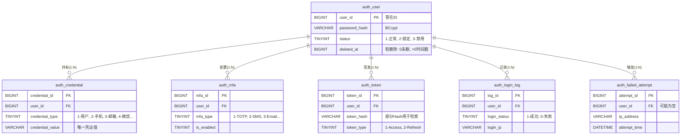

# 认证服务数据库设计

本目录包含 **Valhalla Auth** 服务的数据库表结构设计。该服务专注于身份认证、Token 管理及安全防护。

## 核心架构 (ER图)



## 目录结构

```text
db/
├── schema/              # 单表定义 (DDL)
│   ├── auth_user.sql
│   ├── auth_credential.sql
│   ├── auth_mfa.sql
│   ├── auth_failed_attempt.sql
│   ├── auth_login_log.sql
│   └── auth_token.sql
└── migration/           # 数据库版本迁移脚本
    └── V1.0.0__create_auth_tables.sql
```

## 关键设计规范

### 1. 核心字段策略
*   **主键 (ID)**: 全局统一使用 **雪花算法 (Snowflake ID)** 生成 `BIGINT`。
*   **软删除**: 统一使用 `deleted_at` (`BIGINT`)。
    *   `0`: 未删除
    *   `>0`: 删除时间戳 (Unix Timestamp)
    *   *优势*: 可直接在 `UNIQUE` 索引中引用 (如 `UNIQUE KEY (type, value, deleted_at)`), 解决 MySQL 唯一索引无法忽略 NULL 的问题。

### 2. 状态码字典

| 字段 | 值域说明 |
| :--- | :--- |
| **credential_type** | 1-用户名, 2-手机号, 3-邮箱, 4-微信, 5-Google, 6-其他 |
| **mfa_type** | 1-TOTP, 2-短信, 3-邮箱, 4-U2F |
| **status (User)** | 1-正常, 2-锁定, 3-禁用, 4-过期 |
| **login_type** | 1-密码, 2-微信, 3-Google, 4-Token, 5-其他 |
| **token_type** | 1-Access Token, 2-Refresh Token |

### 3. 安全策略
*   **密码存储**: 强制使用 `BCrypt` 哈希。
*   **敏感数据**: 手机号、邮箱在日志中须脱敏；Token 仅存储哈希值，明文仅在签发时返回。
*   **防爆破**: `auth_failed_attempt` 记录所有失败流水，结合 `auth_user.status` 实现账户锁定。

## 快速开始

```bash
# 初始化所有表结构
mysql -u user -p db_name < db/migration/V1.0.0__create_auth_tables.sql
```
