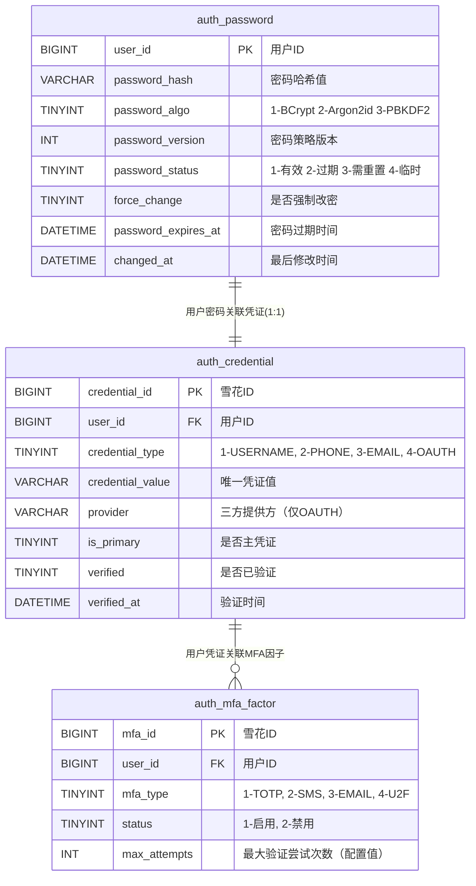

# 认证服务数据库设计

本目录包含 **Valhalla Auth** 服务的数据库表结构设计。该服务专注于身份认证、Token 管理及安全防护。

## 核心架构 (ER图)


```mermaid
erDiagram
    %% 核心实体关系
    auth_password ||--|| auth_credential : "用户密码关联凭证(1:1)"
    auth_credential ||--o{ auth_mfa_factor : "用户凭证关联MFA因子"

    auth_password {
        BIGINT user_id PK "用户ID"
        VARCHAR password_hash "密码哈希值"
        TINYINT password_algo "1-BCrypt 2-Argon2id 3-PBKDF2"
        INT password_version "密码策略版本"
        TINYINT password_status "1-有效 2-过期 3-需重置 4-临时"
        TINYINT force_change "是否强制改密"
        DATETIME password_expires_at "密码过期时间"
        DATETIME changed_at "最后修改时间"
    }

    auth_credential {
        BIGINT credential_id PK "雪花ID"
        BIGINT user_id FK "用户ID"
        TINYINT credential_type "1-USERNAME, 2-PHONE, 3-EMAIL, 4-OAUTH"
        VARCHAR credential_value "唯一凭证值"
        VARCHAR provider "三方提供方（仅OAUTH）"
        TINYINT is_primary "是否主凭证"
        TINYINT verified "是否已验证"
        DATETIME verified_at "验证时间"
    }

    auth_mfa_factor {
        BIGINT mfa_id PK "雪花ID"
        BIGINT user_id FK "用户ID"
        TINYINT mfa_type "1-TOTP, 2-SMS, 3-EMAIL, 4-U2F"
        TINYINT status "1-启用, 2-禁用"
        INT max_attempts "最大验证尝试次数（配置值）"
    }

```

## 目录结构

```text
db/
├── schema/              # 单表定义 (DDL)
│   ├── auth_password.sql
│   ├── auth_credential.sql
│   └── auth_mfa_factor.sql
└── migration/           # 数据库版本迁移脚本
    └── V1.0.0__create_auth_tables.sql
```

## 关键设计规范

### 1. 核心字段策略
*   **主键 (ID)**: 凭证表和 MFA 因子表使用 **雪花算法 (Snowflake ID)** 生成 `BIGINT`。
*   **软删除**: 统一使用 `deleted_at` (`BIGINT`)。
    *   `0`: 未删除
    *   `>0`: 删除时间戳 (Unix Timestamp)
    *   *优势*: 可直接在 `UNIQUE` 索引中引用 (如 `UNIQUE KEY (type, value, deleted_at)`), 解决 MySQL 唯一索引无法忽略 NULL 的问题。

### 2. 状态码字典

| 字段 | 值域说明 |
| :--- | :--- |
| **credential_type** | 1-USERNAME, 2-PHONE, 3-EMAIL, 4-OAUTH |
| **password_algo** | 1-BCrypt, 2-Argon2id, 3-PBKDF2 |
| **password_status** | 1-有效, 2-已过期, 3-需重置, 4-临时密码 |
| **mfa_type** | 1-TOTP, 2-短信(SMS), 3-邮箱(EMAIL), 4-U2F |
| **mfa_factor.status** | 1-启用, 2-禁用 |

### 3. 安全策略
*   **密码存储**: 密码哈希存储在 `auth_password` 表中，支持多种密码算法（BCrypt、Argon2、PBKDF2等）。
*   **敏感数据**: 手机号、邮箱在日志中须脱敏；MFA 密钥加密存储。
*   **Token 管理**: Token 由 Redis 或其他外部存储处理，不在数据库中持久化存储。

### 4. 表结构说明

#### auth_password（用户密码表）
- 存储用户密码相关信息
- 一个用户对应一条密码记录
- 支持多种密码算法（BCrypt、Argon2id、PBKDF2等），通过 `password_algo` 字段标识
- 支持密码策略版本管理（`password_version`），便于密码升级
- 支持密码状态管理（`password_status`）：有效、已过期、需重置、临时密码
- 支持密码过期时间（`password_expires_at`）
- 支持首次登录强制改密（`force_change`）

#### auth_credential（登录凭证表）
- 支持多种登录方式：用户名、手机号、邮箱、OAuth 三方登录
- 一个用户可以有多个登录凭证
- OAuth 登录通过 `provider` 字段标识提供方（如 wechat/google/github）
- 支持主凭证标识（`is_primary`）
- 支持凭证验证状态（`verified`、`verified_at`）

#### auth_mfa_factor（MFA因子表）
- 支持 TOTP、短信验证码、邮箱验证码、U2F Key 配置
- 一个用户可以有多个 MFA 因子
- 支持因子状态管理（启用/禁用）
- `max_attempts` 字段存储防暴力破解的配置值，实际尝试次数和锁定状态由 Redis 管理

## 快速开始

```bash
# 初始化所有表结构
mysql -u user -p db_name < db/migration/V1.0.0__create_auth_tables.sql
```
