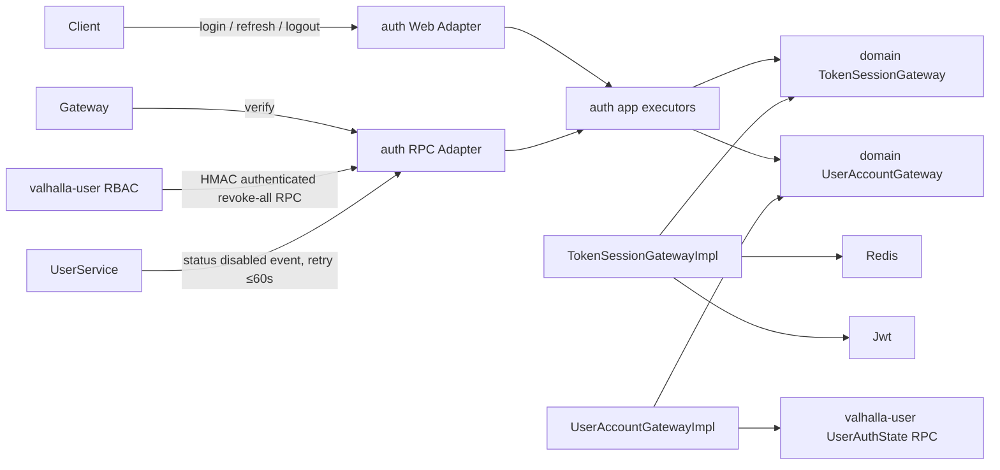

# Token 生命周期管理

## Context

认证服务需要实现可主动吊销的 JWT 会话，并保持既有 `app → domain ← infrastructure` 依赖方向。用户状态和 RBAC 的权威数据位于 `valhalla-user`：auth 只读取最小认证状态，不维护账户状态，也不公开管理员强制登出接口。

## Goal

- 登录、验证、刷新、当前会话登出和用户全会话吊销均可端到端验证。
- 每次刷新轮换 RT；同一 RT 的并发刷新仅成功一次，重放会吊销整个会话。
- 用户禁用后 60 秒内吊销其所有会话。
- Redis Cluster 与单实例 Redis 均支持会话原子操作。

## Non-Goal

- 不实现浏览器 Cookie 投递或设备公钥证明；本迭代仅绑定客户端 `deviceId` 的哈希，作为会话匹配条件。
- 不把用户角色、权限或用户画像写入 JWT。
- 不提供公开的 `logout-all` REST API。
- 不实现 JWT 签名密钥双密钥滚动。

## Architecture



`TokenSessionGateway` 和 `UserAccountGateway` 是 domain 层端口；infrastructure 实现端口，因此不反向依赖 app。app executor 只负责编排、错误码转换与 DTO 组装。

## Interface Contract

### Domain ports

```java
public interface TokenSessionGateway {
    TokenPair issue(long userId, DeviceSession device);
    VerifiedAccessToken verifyAccess(String accessToken);
    TokenPair rotate(String refreshToken, DeviceSession device);
    void revokeCurrentAccessToken(String accessToken);
    void revokeAll(long userId, RevocationReason reason);
}

public interface UserAccountGateway {
    UserAuthState getAuthState(long userId);
}

public record UserAuthState(long userId, boolean enabled, long statusVersion) {}
public record DeviceSession(String deviceId, String deviceType, String deviceName) {}
public record TokenPair(String accessToken, String refreshToken, long expiresIn) {}
public record VerifiedAccessToken(long userId, Instant expiresAt, boolean degraded) {}
```

- `issue` 与 `rotate` 在用户不存在或禁用时由 app 在调用前拒绝。
- `rotate` 仅接受 `type=refresh`、签名有效、`iss/aud/sub/jti/sid/iat/nbf/exp` 完整的 JWT；返回新 AT 与新 RT。
- `revokeCurrentAccessToken` 允许 AT 已过期，但始终校验签名、算法、`type=access`、`sub/jti/sid`，并且仅当 `jti` 是会话当前 AT 时删除会话。

### 用户认证状态 RPC（valhalla-user 提供）

```java
SingleResponse<RpcUserAuthStateCO> getUserAuthState(RpcGetUserAuthStateQuery query);
// RpcUserAuthStateCO: userId(Long), enabled(Boolean), statusVersion(Long)
```

该 RPC 仅返回登录决策需要的数据，不能复用含画像和角色列表的 `UserCO`。未知用户、禁用用户、RPC 超时或返回异常时，登录与刷新 fail-closed；访问令牌验证保留既有 Redis 降级语义。

### 内部强制登出 RPC（auth 提供）

```java
Response revokeAllTokens(RpcRevokeAllTokensCmd cmd);
// targetUserId, operatorId, reason, issuedAtEpochSeconds, nonce, signature
```

- 仅 `valhalla-user` 在 RBAC 授权成功后调用；不映射 Web 路由。
- `signature = HMAC-SHA-256(serviceName + targetUserId + operatorId + reason + issuedAt + nonce)`。
- auth 校验 serviceName 固定为 `valhalla-user`、签名、60 秒时间窗与 Redis nonce 一次性消费；任何失败返回 `RPC_CALLER_UNAUTHORIZED`，不执行吊销。
- 生产部署必须以 NetworkPolicy/等价网络 ACL 限制 RPC 端口仅接受 user 服务流量；mTLS 是后续替换 HMAC 的目标。

### 用户禁用事件

用户状态从启用变为禁用后，`valhalla-user` 写入可重试的 outbox 事件；投递器调用上述内部 RPC，直到成功。事件创建到成功吊销的 SLA 为 60 秒。事件包含 targetUserId、状态版本、操作人、原因和关联 ID；auth 记录相同审计字段。

## Data Model

JWT 统一包含 `iss`、`aud`、`sub`、`jti`、`sid`、`iat`、`nbf`、`exp` 与 `type`。签名算法固定 HS256，解析器仅接受该算法。

| Key | TTL | Value | 说明 |
|---|---|---|---|
| `token:{userId}:access:{jti}` | AT TTL | `sid` | 当前 AT 白名单 |
| `token:{userId}:refresh:{rtJti}` | RT 剩余 TTL | `sid` | 当前 RT 白名单 |
| `token:{userId}:used-refresh:{rtJti}` | 原 RT 剩余 TTL | `sid` | 重放检测 |
| `token:{userId}:session:{sid}` | RT TTL | userId、currentAtJti、currentRtJti、deviceIdHash、expiresAt | 会话权威记录 |
| `token:{userId}:sessions` | 显式管理 | ZSET: sid，score=RT 绝对过期毫秒 | 会话上限与 FIFO |
| `token:rpc:nonce:{nonce}` | 60 秒 | caller service | 内部 RPC 防重放 |

同一用户会话操作的 key 使用 `{userId}` hash tag，保证 Redis Cluster 的 Lua 脚本在同一 slot 执行。脚本在创建、刷新和会话上限检查前移除已过期 ZSET 成员；所有会话删除同步删除索引成员。

刷新 Lua 脚本必须原子完成：确认 session 的 currentRtJti 与提交 RT 一致、写旧 RT 已使用标记、删除旧 AT/RT、写新 AT/RT/session、更新 ZSET。若提交 RT 已在 used-refresh 中，脚本删除整个 session 并返回 `TOKEN_REPLAYED`；其他并发请求返回 `TOKEN_REVOKED`。

## Error Handling

| 依赖/场景 | 策略 |
|---|---|
| Redis 验证读失败 | 仅 AT 验证返回 `degraded=true`；不读取用户状态。 |
| Redis 写、Lua 或 nonce 操作失败 | 登录、刷新、登出和强制登出返回 `REDIS_UNAVAILABLE`。 |
| user auth-state RPC 超时/失败 | 登录、刷新返回 `USER_STATE_UNAVAILABLE`，不签发 token。 |
| RT 重放 | 吊销整个 sid，返回 `TOKEN_REPLAYED`。 |
| HMAC 无效、过期或 nonce 重复 | 返回 `RPC_CALLER_UNAUTHORIZED`，不泄露签名校验细节。 |
| 用户禁用 outbox 投递失败 | 指数退避重试并告警；超过 60 秒触发告警和人工处理。 |

## Non-Functional Requirements

| 维度 | 指标 |
|---|---|
| Token 验证 | Redis 正常时 P99 ≤ 50ms；降级本地验签 P99 ≤ 5ms |
| 登录 | P99 ≤ 200ms，含用户状态 RPC、BCrypt 与 Redis Lua |
| 会话上限 | 默认 5，任何并发登录后不超过 5 条有效 session |
| 禁用传播 | user 状态变更后 60 秒内完成全会话吊销 |
| 安全 | JWT 密钥 ≥256 位；HMAC 时间窗 60 秒；nonce 单次使用 |
| 审计 | 登录、刷新、RT 重放、吊销和内部 RPC 拒绝均记录关联 ID |

## Alternatives Considered

| 方案 | 不选原因 |
|---|---|
| 一个 ZSET 成员保存 AT 与 RT | AT 过期、RT 轮换和多 key 清理无法可靠保持配对。 |
| 刷新时保留 RT | 无法检测和遏制被窃 RT 的重放。 |
| auth 自行查询/维护角色 | 违反用户服务拥有 RBAC 的边界。 |
| 仅凭 K8s 内网保护强制登出 RPC | 不能防止横向调用；至少需要 HMAC 与网络 ACL。 |

## Testing Strategy

| 对象 | 层级 | 通过标准 |
|---|---|---|
| TokenSessionGateway Lua | Redis 集成 | 并发刷新只一成功；重放吊销 sid；旧 AT 不能删新 session；Cluster hash tag 无 CROSSSLOT |
| JWT provider | 单元 | 拒绝算法/issuer/audience/type/必填 claim 异常；仅登出路径豁免 exp |
| UserAccountGateway | 单元 | enabled 返回可登录；禁用、未知、超时均 fail-closed |
| 用户认证状态 RPC | Dubbo 集成 | 仅返回最小状态对象，状态版本递增可观察 |
| 内部 revoke-all RPC | 集成 | 有效 HMAC 成功；签名、时间窗、nonce 重放均拒绝 |
| 禁用 outbox | 集成 | 禁用后 60 秒内调用 auth 并撤销全部会话；失败重试可恢复 |
| 全生命周期 | 端到端 | 登录→验证→轮换→登出；多会话 FIFO；Redis 降级行为符合 Spec |

## Milestones

| 阶段 | 产出 | 依赖 |
|---|---|---|
| 1 | user auth-state RPC 与禁用事件 outbox | 无 |
| 2 | auth domain ports、JWT、Redis 原子会话 | 1 的 client 契约 |
| 3 | app/adapters、HMAC 内部 RPC | 2 |
| 4 | 集成、并发与安全测试 | 1-3 |
