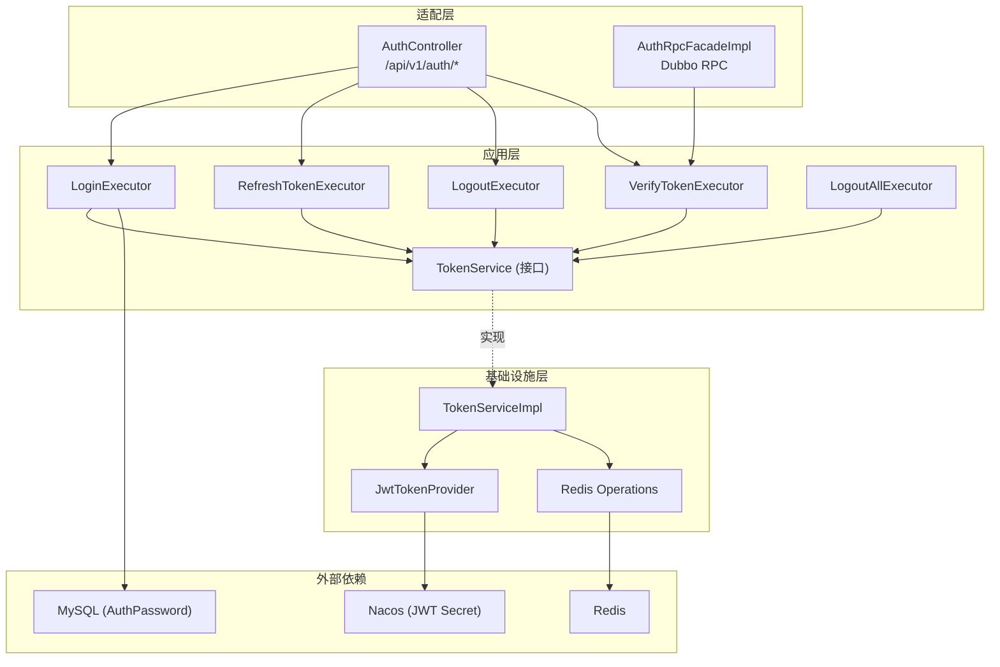

# Token 生命周期管理

## Context

valhalla-auth 认证服务当前 Token 相关功能均为 TODO 状态（LoginExecutor、VerifyTokenExecutor、RefreshTokenExecutor、LogoutExecutor）。现有代码已完成凭证查询和密码实体定义，但缺少：

1. JWT 签发与解析能力
2. Redis 元数据存储（支持主动吊销）
3. 密码验证集成（BCrypt）
4. 会话数管理（多设备并发控制）

本设计基于已有 COLA 5.0 DDD 分层架构，新增 `TokenService` 接口（app 层定义、infrastructure 层实现），通过 jjwt 库签发 JWT、mimir-boot-starter-redis 管理 Token 元数据。

## Goal

- 实现登录签发、验证、刷新、登出（单设备 + 全设备）完整 Token 生命周期
- Token 验证 P99 延迟 ≤ 50ms
- Redis 不可用时验证操作降级放行，写操作返回明确错误
- 单用户最大并发会话数可配置（默认 5），超限 FIFO 踢出

## Non-Goal

- 密钥轮换（双密钥滚动）— 后续迭代
- Refresh Token 轮换 — 当前 RT 不轮换
- MFA 多因子验证流程（数据模型已就绪，业务流程后续实现）
- Token 黑名单持久化到数据库（仅 Redis）
- 微信/OAuth 第三方登录

## Architecture



**数据流：**

1. **登录**：Adapter → LoginExecutor → 查询凭证(MySQL) → 验证密码 → TokenService.issueTokenPair → 写 Redis → 返回 LoginResultCO { token: TokenCO, user: AuthUserCO }
2. **验证**：Adapter → VerifyTokenExecutor → TokenService.verifyAccessToken → JWT 本地校验 → Redis 存在性检查（降级跳过） → 返回 VerifyTokenCO
3. **刷新**：Adapter → RefreshTokenExecutor → TokenService.refreshAccessToken → JWT 校验 RT → Redis 确认 RT 有效 → 签发新 AT → 写 Redis → 返回 TokenCO
4. **登出**：Adapter → LogoutExecutor → TokenService.revokeToken → 删除 AT/RT Redis key + 清理 ZSET → 返回 Response
5. **全部登出**：Adapter → LogoutAllExecutor → TokenService.revokeAllTokens → 遍历 ZSET 批量删除 → 返回 Response

## Interface Contract

### 1. TokenService（app 层接口）

> 对应 Spec: 所有 Behavior

```java
package com.yggdrasil.labs.app.auth.service;

/**
 * Token 生命周期服务接口
 * 定义在 app 层，由 infrastructure 层实现
 */
public interface TokenService {

    /**
     * 签发令牌对（AT + RT）
     * 对应 Spec: 登录获取凭证 - 正常登录 / 超过最大会话数
     *
     * @param userId 用户ID
     * @return 令牌对信息
     * @throws TokenServiceException REDIS_UNAVAILABLE - 缓存服务不可用
     */
    TokenPairResult issueTokenPair(Long userId);

    /**
     * 验证访问令牌
     * 对应 Spec: 验证访问令牌 - 全部场景
     *
     * @param accessToken JWT 字符串
     * @return 验证结果
     * @throws TokenServiceException TOKEN_EXPIRED / TOKEN_INVALID / TOKEN_REVOKED
     */
    VerifyTokenResult verifyAccessToken(String accessToken);

    /**
     * 刷新访问令牌
     * 对应 Spec: 刷新访问令牌 - 全部场景
     *
     * @param refreshToken JWT 字符串
     * @return 新的访问令牌信息
     * @throws TokenServiceException TOKEN_EXPIRED / TOKEN_REVOKED / REDIS_UNAVAILABLE
     */
    RefreshTokenResult refreshAccessToken(String refreshToken);

    /**
     * 吊销令牌（当前会话）
     * 对应 Spec: 登出 - 全部场景
     *
     * @param accessToken JWT 字符串（允许已过期）
     * @throws TokenServiceException REDIS_UNAVAILABLE
     */
    void revokeToken(String accessToken);

    /**
     * 吊销用户所有令牌
     * 对应 Spec: 强制登出所有设备 - 全部场景
     *
     * @param userId 用户ID
     * @throws TokenServiceException REDIS_UNAVAILABLE
     */
    void revokeAllTokens(Long userId);
}
```

**Result DTOs（app 层）：**

```java
/** TokenService 返回的令牌对 */
@Data
public class TokenPairResult {
    private String accessToken;   // JWT 字符串
    private String refreshToken;  // JWT 字符串
    private Long expiresIn;       // AT 有效期（秒），固定 900
}

/** 验证结果 */
@Data
public class VerifyTokenResult {
    private Long userId;
    private LocalDateTime expiresAt;
    private Boolean degraded;  // true 表示 Redis 不可用，降级放行
}

/** 刷新结果 */
@Data
public class RefreshTokenResult {
    private String accessToken;  // 新签发的 AT
    private Long expiresIn;      // 900
}
```

### 2. LoginExecutor 改造

> 对应 Spec: 登录获取凭证 - 全部场景

```java
/**
 * 执行登录
 * @param cmd LoginCmd { credentialType, credentialValue, password }
 * @return SingleResponse<LoginResultCO> 包含 TokenCO { accessToken, refreshToken, expiresIn, ... } 和 AuthUserCO { userId, status, ... }
 *
 * 错误码：
 * - CREDENTIAL_NOT_FOUND → "用户名或密码错误"
 * - ACCOUNT_LOCKED → "账号已锁定，请 N 分钟后再试"
 * - ACCOUNT_DISABLED → "账号已被禁用，请联系管理员"
 * - PASSWORD_INCORRECT → "用户名或密码错误"（不区分用户不存在和密码错误）
 * - REDIS_UNAVAILABLE → "服务暂时不可用，请稍后重试"
 */
@Transactional(rollbackFor = Exception.class)
public SingleResponse<LoginResultCO> execute(LoginCmd cmd);
```

### 3. VerifyTokenExecutor

> 对应 Spec: 验证访问令牌 - 全部场景
> ⚠️ Breaking Change: 返回类型从 `SingleResponse<AuthUserCO>` 变更为 `SingleResponse<VerifyTokenCO>`
> 需同步修改 `AuthApplicationService.verifyToken` 签名及其实现类

```java
/**
 * 验证访问令牌
 * @param cmd VerifyTokenCmd { token }
 * @return SingleResponse<VerifyTokenCO>
 *
 * 返回 VerifyTokenCO { userId, expiresAt, degraded }
 *
 * 错误码：
 * - TOKEN_EXPIRED → "令牌已过期"
 * - TOKEN_INVALID → "令牌无效"
 * - TOKEN_REVOKED → "令牌已吊销"
 */
public SingleResponse<VerifyTokenCO> execute(VerifyTokenCmd cmd);
```

### 4. RefreshTokenExecutor

> 对应 Spec: 刷新访问令牌 - 全部场景

```java
/**
 * 刷新访问令牌
 * @param cmd RefreshTokenCmd { refreshToken }
 * @return SingleResponse<TokenCO>
 *
 * 返回 TokenCO { accessToken, expiresIn }（refreshToken 字段为 null，原 RT 不变）
 *
 * 错误码：
 * - TOKEN_EXPIRED → "刷新令牌已过期，请重新登录"
 * - TOKEN_REVOKED → "刷新令牌已失效"
 * - REDIS_UNAVAILABLE → "服务暂时不可用，请稍后重试"
 */
public SingleResponse<TokenCO> execute(RefreshTokenCmd cmd);
```

### 5. LogoutExecutor 改造

> 对应 Spec: 登出 - 全部场景

```java
/**
 * 登出当前会话
 * @param cmd LogoutCmd { accessToken }（revokeAll=false）
 * @return Response
 *
 * 错误码：
 * - REDIS_UNAVAILABLE → "服务暂时不可用，请稍后重试"
 */
public Response execute(LogoutCmd cmd);
```

### 6. LogoutAllExecutor（新增）

> 对应 Spec: 强制登出所有设备 - 全部场景

```java
/**
 * 强制登出所有设备
 * @param cmd LogoutCmd { userId, revokeAll=true }
 * @return Response
 *
 * 错误码：
 * - REDIS_UNAVAILABLE → "服务暂时不可用，请稍后重试"
 */
public Response execute(LogoutCmd cmd);
```

### 7. AuthRpcFacade 扩展（client 层）

> 对应 Spec: 验证访问令牌（网关调用）

```java
/**
 * 验证 Token（供 bifrost-gateway 通过 Dubbo 调用）
 * @param cmd RpcVerifyTokenCmd { token }
 * @return SingleResponse<RpcVerifyTokenCO> { userId, expiresAt, degraded }
 */
SingleResponse<RpcVerifyTokenCO> verifyToken(RpcVerifyTokenCmd cmd);
```

## Data Model

### Redis Key 结构

| Key | 类型 | TTL | 值/成员 | 用途 |
|-----|------|-----|---------|------|
| `token:access:{jti}` | String | 15min（可配置） | `{userId}:{rtJti}`（冒号分隔，登出时从 value 提取关联 RT） | AT 存在性验证 + 关联 RT 定位 |
| `token:refresh:{jti}` | String | 7d（可配置） | `userId` | RT 存在性验证 |
| `user:tokens:{userId}` | ZSET | 无（手动管理） | 成员: `at:{jti}` / `rt:{jti}`，score: 签发时间戳（epoch millis） | 会话管理、会话数限制、登出定位 |

**操作模式：**

- **签发**：SET `token:access:{atJti}` = `{userId}:{rtJti}` + SET `token:refresh:{rtJti}` = `{userId}` + ZADD `user:tokens:{userId}` (at:{atJti}, rt:{rtJti})
- **验证**：EXISTS `token:access:{jti}`（仅检查存在性，不解析 value）
- **刷新**：EXISTS `token:refresh:{rtJti}` → DEL 旧 AT key → SET 新 AT key（value 包含同一 rtJti） → ZREM 旧 at 成员 + ZADD 新 at 成员
- **登出**：GET `token:access:{atJti}` → 解析 value 得到 rtJti → DEL `token:access:{atJti}` + DEL `token:refresh:{rtJti}` + ZREM `user:tokens:{userId}` (at:{atJti}, rt:{rtJti})
- **全部登出**：ZRANGE `user:tokens:{userId}` 0 -1 → 按前缀分类批量 DEL → DEL `user:tokens:{userId}`
- **会话数限制**：ZCARD `user:tokens:{userId}` / 2 > max-sessions → ZPOPMIN 踢出最早成员对应的 AT/RT key

### 配置项（Nacos）

| 配置 | 默认值 | 说明 |
|------|--------|------|
| `auth.jwt.secret` | — (必填) | HS256 签名密钥，≥ 256 位 |
| `auth.token.access-token-ttl` | `15m` | Access Token 有效期 |
| `auth.token.refresh-token-ttl` | `7d` | Refresh Token 有效期 |
| `auth.token.max-sessions` | `5` | 单用户最大并发会话数 |
| `auth.password.lock-threshold` | `5` | 连续失败锁定阈值 |
| `auth.password.lock-duration` | `30m` | 锁定时长 |

### JWT Claims 结构

```json
{
  "sub": "10001",
  "jti": "550e8400-e29b-41d4-a716-446655440000",
  "iat": 1752364800,
  "exp": 1752365700,
  "type": "access"
}
```

- `type` 取值：`access` | `refresh`
- `sub` 为字符串形式的 userId

## Error Handling

| 外部依赖 | 失败场景 | 处理策略 | 影响范围 |
|----------|----------|----------|----------|
| Redis | 连接超时/不可用 | 验证：降级放行（跳过吊销检查，返回 `degraded=true`）；写操作（登录/刷新/登出）：返回 `REDIS_UNAVAILABLE` 错误 | 验证不受影响，登录/刷新/登出暂不可用 |
| Redis | 单次命令超时 | 等同连接不可用处理，Redis 配置合理超时（200ms） | 同上 |
| MySQL | 查询凭证/密码失败 | 登录返回 500 服务内部错误，事务回滚 | 仅登录受影响 |
| Nacos | JWT Secret 配置缺失 | 应用启动失败（@Value 必填校验） | 服务无法启动 |
| Nacos | 运行时配置刷新失败 | 使用内存中已缓存的配置值继续运行 | 无影响 |
| 乐观锁 | 密码失败计数并发冲突 | 捕获 OptimisticLockException，重试 1 次，仍失败则忽略（安全方向：少计一次不影响安全） | 极端并发下可能少计一次失败 |

### 新增错误码

| 错误码 | HTTP Status | 描述 | 触发场景 |
|--------|-------------|------|----------|
| `ACCOUNT_LOCKED` | 423 | 账号已锁定 | 连续失败超过阈值 |
| `ACCOUNT_DISABLED` | 403 | 账号已被禁用 | 管理员禁用 |
| `TOKEN_EXPIRED` | 401 | 令牌已过期 | AT/RT 超过有效期 |
| `TOKEN_INVALID` | 401 | 令牌无效 | 签名错误/格式错误 |
| `TOKEN_REVOKED` | 401 | 令牌已吊销 | Redis key 不存在（已登出） |
| `REDIS_UNAVAILABLE` | 503 | 服务暂时不可用 | Redis 连接失败 + 写操作 |

## Non-Functional Requirements

| 指标 | 目标 | 度量方式 |
|------|------|----------|
| Token 验证延迟 P99 | ≤ 50ms | 本地 JWT 校验 + Redis GET |
| Token 验证降级延迟 P99 | ≤ 5ms | 纯本地 JWT 校验（无网络 IO） |
| 登录延迟 P99 | ≤ 200ms | MySQL 查询 + BCrypt 验证 + Redis 写入 |
| JWT Secret 长度 | ≥ 256 位 | 启动校验 |
| Redis 命令超时 | 200ms | Spring Data Redis 配置 |
| 最大并发会话 | 可配置，默认 5 | ZSET ZCARD |
| 密码存储算法 | BCrypt (cost=10) | PasswordService |

## Alternatives Considered

### 备选方案：Token 黑名单模式（而非白名单）

**方案描述**：不在 Redis 存储有效 Token，仅在吊销时写入黑名单 key（`token:blacklist:{jti}` TTL=AT 剩余有效期）。验证时检查黑名单不存在即通过。

**优点**：
- Redis 写入量少（仅登出时写）
- 正常验证路径 Redis 命中率低

**放弃原因**：
- 无法支持"全部登出"（不知道有哪些活跃 Token）
- 无法支持会话数限制（不知道当前会话数）
- Redis 不可用时无法保证吊销生效

**当前方案优势**：白名单模式天然支持会话管理、全部登出、Redis 不可用时保守降级（key 不存在 = 已吊销，但降级放行只在验证场景）。

## Testing Strategy

| 测试对象 | 层级 | 验证方法 | 通过标准 |
|----------|------|----------|----------|
| TokenServiceImpl.issueTokenPair | 单元测试 | Mock Redis，验证 JWT 结构和 Redis 命令 | AT/RT 含正确 claims；Redis SET 和 ZADD 各执行 1 次 |
| TokenServiceImpl.verifyAccessToken | 单元测试 | Mock Redis EXISTS 返回 true/false/异常 | 有效返回 userId；key 不存在返回 TOKEN_REVOKED；Redis 异常返回 degraded=true |
| TokenServiceImpl.refreshAccessToken | 单元测试 | Mock Redis EXISTS + SET | RT 有效时返回新 AT；RT 不存在返回 TOKEN_REVOKED；Redis 异常返回 REDIS_UNAVAILABLE |
| TokenServiceImpl.revokeToken | 单元测试 | Mock Redis DEL + ZREM | 验证删除正确的 key 和 ZSET 成员 |
| TokenServiceImpl.revokeAllTokens | 单元测试 | Mock Redis ZRANGE + DEL | 验证批量删除所有成员对应 key |
| TokenServiceImpl 会话数限制 | 单元测试 | Mock ZCARD 返回 ≥ max-sessions | 验证 ZPOPMIN 被调用，最早会话对应 key 被删除 |
| LoginExecutor 正常登录 | 单元测试 | Mock 凭证/密码仓储 + TokenService | 验证密码匹配后调用 issueTokenPair，返回 LoginResultCO |
| LoginExecutor 密码错误 | 单元测试 | Mock 密码不匹配 | 验证失败计数递增，返回 PASSWORD_INCORRECT |
| LoginExecutor 账号锁定 | 单元测试 | Mock AuthPassword locked_until > now | 返回 ACCOUNT_LOCKED |
| LoginExecutor 超限踢出 | 单元测试 | 模拟 issueTokenPair 触发 FIFO | 验证登录成功且最早会话被踢出 |
| VerifyTokenExecutor | 单元测试 | Mock TokenService | 各错误码正确传递 |
| RefreshTokenExecutor | 单元测试 | Mock TokenService | 返回新 AT，原 RT 不受影响 |
| LogoutExecutor | 单元测试 | Mock TokenService.revokeToken | 验证调用正确方法 |
| LogoutAllExecutor | 单元测试 | Mock TokenService.revokeAllTokens | 验证调用正确方法 |
| JwtTokenProvider | 单元测试 | 真实 jjwt 库 | 签发 → 解析还原 claims；篡改签名 → 抛异常；过期 → 抛异常 |
| Redis 降级 | 集成测试 | Embedded Redis 启动后关闭 | 验证验证降级放行；写操作返回 REDIS_UNAVAILABLE |
| 登录→验证→刷新→登出 全流程 | 集成测试 | Testcontainers (Redis + MySQL) | 端到端流程正确，Token 状态变更符合预期 |
| AuthController REST API | 集成测试 | MockMvc + @SpringBootTest | HTTP 状态码、响应体结构正确 |
| AuthRpcFacade.verifyToken | 集成测试 | Dubbo 测试框架 | RPC 调用返回正确结果 |

## Milestones

### Phase 1：基础设施层（TokenService 实现）

**交付物：**
- `mimir-boot-starter-redis` 依赖引入（valhalla-auth-start/pom.xml）
- `jjwt` 依赖引入（valhalla-auth-infrastructure/pom.xml）
- `JwtTokenProvider`：JWT 签发 + 解析 + 校验
- `TokenService` 接口定义（app 层）
- `TokenServiceImpl` 实现（infrastructure 层）：issueTokenPair、verifyAccessToken、refreshAccessToken、revokeToken、revokeAllTokens
- Redis 配置（application.yml / Nacos）
- 单元测试覆盖 TokenService 所有方法

### Phase 2：Executor 实现（登录 + 验证）

**交付物：**
- `LoginExecutor` 改造：密码验证（BCrypt）+ TokenService 集成 + 失败计数 + 锁定逻辑
- `VerifyTokenExecutor` 改造：委托 TokenService.verifyAccessToken
- `VerifyTokenCO` 新增（替代原 AuthUserCO 用于验证场景）
- 新增错误码：ACCOUNT_LOCKED、ACCOUNT_DISABLED、TOKEN_EXPIRED、TOKEN_INVALID、TOKEN_REVOKED
- AuthPassword 领域实体扩展：`failedAttempts`、`lockedUntil` 字段
- 数据库迁移脚本：auth_password 表增加锁定相关字段
- 单元测试覆盖全部登录场景

### Phase 3：刷新 + 登出

**交付物：**
- `RefreshTokenExecutor` 改造：委托 TokenService.refreshAccessToken
- `LogoutExecutor` 改造：委托 TokenService.revokeToken
- `LogoutAllExecutor` 新增：委托 TokenService.revokeAllTokens
- `LogoutCmd` 调整：增加 `accessToken` 字段逻辑
- 新增错误码：REDIS_UNAVAILABLE
- 单元测试覆盖全部刷新和登出场景

### Phase 4：RPC 契约 + 集成测试

**交付物：**
- `valhalla-auth-client`：新增 `RpcVerifyTokenCmd`、`RpcVerifyTokenCO`、`AuthRpcFacade.verifyToken` 方法
- `AuthRpcFacadeImpl`：实现 verifyToken RPC
- 集成测试：Redis 降级测试、全流程测试、REST API 测试
- Nacos 配置项文档化
