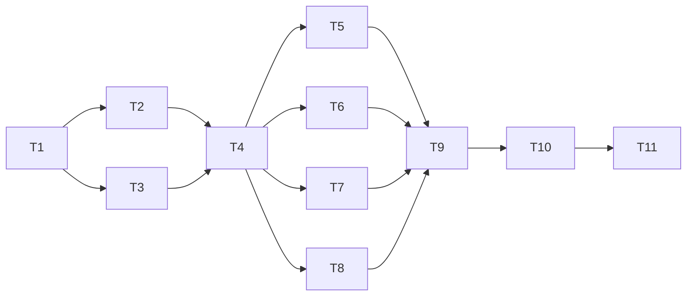

# Token 生命周期管理

**Branch:** [待填充]
**Baseline SHA:** [待填充]
**Worktree Path:** [待填充]
**Started At:** [待填充]
**Updated At:** [待填充]

**Goal:** 实现登录签发、验证、刷新、登出（单设备+全设备）完整 Token 生命周期，支持 Redis 降级和会话数控制
**Architecture:** 新增 TokenService 接口（app 层定义、infrastructure 层实现），通过 jjwt 签发 JWT，mimir-boot-starter-redis 管理 Token 元数据（白名单模式），Executor 层编排业务流程
**Tech Stack:** Java 17, Spring Boot 3.3 (mimir-boot 2.1.0), COLA 5.0, jjwt 0.12.x, mimir-boot-starter-redis, MyBatis-Plus, JUnit 5 + Mockito + Testcontainers
**Commit Mode:** per-task
**Batch Commit Tasks:** null
**Batch Commit Reason:** null
**Effective Execution Mode:** [待填充]
**Final Record Mode:** terminal-exception

## Global Constraints

- Java 17，Spring Boot 3.3（mimir-boot 2.1.0 封装）
- COLA 5.0 DDD 分层：依赖方向 start → adapter → app → domain ← infrastructure
- domain 层零外部依赖，不依赖 Spring 框架
- adapter 不直接访问 domain 或 infrastructure，必须经由 app 层
- TokenService 接口定义在 app 层（`com.yggdrasil.labs.app.auth.service`），实现在 infrastructure 层
- JWT 库：io.jsonwebtoken:jjwt-api + jjwt-impl + jjwt-jackson
- Redis：mimir-boot-starter-redis（Spring Data Redis），命令超时 200ms
- 密码算法：BCrypt (cost=10)
- 乐观锁并发冲突：重试 1 次，仍失败则忽略
- Redis 不可用时：验证降级放行（degraded=true）；写操作（登录/刷新/登出）返回 REDIS_UNAVAILABLE 错误
- JWT Secret ≥ 256 位，启动时校验
- 单用户最大并发会话数默认 5，FIFO 踢出
- 代码格式：Spotless (Google AOSP 4 空格缩进)
- 测试框架：JUnit 5 + Mockito（单元）+ Testcontainers（集成）
- 包基路径：`com.yggdrasil.labs`
- Conventional Commits，message 中文

## Dependency Graph



| Task | 依赖 | 可并行组 |
|------|------|---------|
| T1 | 无 | A |
| T2 | T1 | B |
| T3 | T1 | B |
| T4 | T2, T3 | C |
| T5 | T4 | D |
| T6 | T4 | D |
| T7 | T4 | E |
| T8 | T4 | D |
| T9 | T5, T6, T7, T8 | F |
| T10 | T9 | G |
| T11 | T10 | H |

---

### T1: 依赖引入与 Redis 配置

**Depends on:** 无

**Files:**
- Modify: `valhalla-auth-start/pom.xml`
- Modify: `valhalla-auth-infrastructure/pom.xml`
- Modify: `valhalla-auth-start/src/main/resources/application.yml`
- Create: `valhalla-auth-infrastructure/src/test/java/com/yggdrasil/labs/infrastructure/redis/RedisConnectionTest.java`

**Interfaces:**
- Consumes: none
- Produces: none（基础设施依赖，无代码接口产出）

**Behavior:**
引入 mimir-boot-starter-redis 到 start 模块（Redis 连接、Spring Data Redis 自动配置），引入 jjwt 三件套到 infrastructure 模块（JWT 签发解析能力）。配置 Redis 连接参数和 Token 相关配置项（auth.jwt.secret、auth.token.*、auth.password.*）。

**Acceptance Criteria:**
- [ ] AC1: `./mvnw clean compile -pl valhalla-auth-start -am` 编译通过，mimir-boot-starter-redis 和 jjwt 依赖解析成功
- [ ] AC2: application.yml 中包含 `spring.data.redis` 配置段和 `auth.jwt.secret`、`auth.token.access-token-ttl`、`auth.token.refresh-token-ttl`、`auth.token.max-sessions`、`auth.password.lock-threshold`、`auth.password.lock-duration` 配置项

**Execution:**
- **Status:** pending
- **Commit SHA:** null
- **Attempts:** 0
- **Blocked Reason:** null
- **Red Result:** null
- **Verify Result:** null
- **AC Result:** null

**Task Completion Gate:**
- [ ] Red Result exists and passed
- [ ] Verify Result exists and passed
- [ ] AC Result: null (task AC declares no per-task AC) OR (total > 0 AND pass + deferred.length == total, non-deferred AC all verified)
- [ ] Commit SHA belongs to this task only
- [ ] Per-task AC checkbox synced

**Step 1: Red**

```bash
# 验证当前 pom.xml 中不存在 redis 和 jjwt 依赖
grep "mimir-boot-starter-redis" valhalla-auth-start/pom.xml || echo "NOT_EXISTS"
grep "jjwt-api" valhalla-auth-infrastructure/pom.xml || echo "NOT_EXISTS"
```
> 两者均输出 NOT_EXISTS → 确认基线

**Step 2: Green**

1. `valhalla-auth-start/pom.xml` `<dependencies>` 段新增：
   - `com.yggdrasil.labs:mimir-boot-starter-redis`（无需指定版本，BOM 管理）

2. `valhalla-auth-infrastructure/pom.xml` `<dependencies>` 段新增：
   - `io.jsonwebtoken:jjwt-api:0.12.6`
   - `io.jsonwebtoken:jjwt-impl:0.12.6` (scope=runtime)
   - `io.jsonwebtoken:jjwt-jackson:0.12.6` (scope=runtime)

3. `application.yml` 新增配置段：
```yaml
spring:
  data:
    redis:
      host: ${REDIS_HOST:localhost}
      port: ${REDIS_PORT:6379}
      timeout: 200ms
      lettuce:
        pool:
          max-active: 8
          max-idle: 8
          min-idle: 2

auth:
  jwt:
    secret: ${AUTH_JWT_SECRET:}
  token:
    access-token-ttl: 15m
    refresh-token-ttl: 7d
    max-sessions: 5
  password:
    lock-threshold: 5
    lock-duration: 30m
```

**Step 3: Verify**

Run: `./mvnw clean compile -pl valhalla-auth-start -am -q`
Expected: **PASS** — 编译成功，无错误输出

**AC Verification:**
- AC1: `./mvnw clean compile -pl valhalla-auth-start -am` → exit code 0
- AC2: `grep -c "auth.jwt.secret\|access-token-ttl\|refresh-token-ttl\|max-sessions\|lock-threshold\|lock-duration" valhalla-auth-start/src/main/resources/application.yml` → 输出 ≥ 6

**Step 4: Commit**

`feat(infra): 引入 Redis 和 JWT 依赖及配置项`

---

### T2: JwtTokenProvider 实现

**Depends on:** T1

**Files:**
- Create: `valhalla-auth-infrastructure/src/main/java/com/yggdrasil/labs/infrastructure/token/JwtTokenProvider.java`
- Create: `valhalla-auth-infrastructure/src/main/java/com/yggdrasil/labs/infrastructure/token/JwtProperties.java`
- Create: `valhalla-auth-infrastructure/src/test/java/com/yggdrasil/labs/infrastructure/token/JwtTokenProviderTest.java`

**Interfaces:**
- Consumes: none
- Produces: `JwtTokenProvider.generateToken(Long userId, String type, Duration ttl): String` | `JwtTokenProvider.parseToken(String token): Claims` | `JwtTokenProvider.getJtiFromToken(String token, boolean allowExpired): String` | `JwtTokenProvider.getUserIdFromToken(String token, boolean allowExpired): Long`

**Behavior:**
封装 jjwt 库，提供 JWT 签发（含 sub/jti/iat/exp/type claims）和解析能力。签发使用 HS256 + 配置密钥，解析时校验签名和过期时间。支持从已过期 token 中提取 jti（用于登出场景）。启动时校验密钥长度 ≥ 256 位。

**Acceptance Criteria:**
- [ ] AC1: generateToken 签发的 JWT 包含 sub(userId)、jti(UUID)、iat、exp、type claims，且 parseToken 能正确还原所有字段
- [ ] AC2: 篡改签名后 parseToken 抛出 SignatureException；token 过期后 parseToken 抛出 ExpiredJwtException
- [ ] AC3: 密钥长度 < 256 位时 @PostConstruct 抛出 IllegalArgumentException

**Execution:**
- **Status:** pending
- **Commit SHA:** null
- **Attempts:** 0
- **Blocked Reason:** null
- **Red Result:** null
- **Verify Result:** null
- **AC Result:** null

**Task Completion Gate:**
- [ ] Red Result exists and passed
- [ ] Verify Result exists and passed
- [ ] AC Result: null (task AC declares no per-task AC) OR (total > 0 AND pass + deferred.length == total, non-deferred AC all verified)
- [ ] Commit SHA belongs to this task only
- [ ] Per-task AC checkbox synced

**Step 1: Red**

```java
@Test
void generateAndParse_shouldReturnCorrectClaims() {
    String token = jwtTokenProvider.generateToken(10001L, "access", Duration.ofMinutes(15));
    Claims claims = jwtTokenProvider.parseToken(token);
    assertEquals("10001", claims.getSubject());
    assertEquals("access", claims.get("type", String.class));
    assertNotNull(claims.getId()); // jti
}

@Test
void parseToken_withTamperedSignature_shouldThrowException() {
    String token = jwtTokenProvider.generateToken(1L, "access", Duration.ofMinutes(15));
    String tampered = token.substring(0, token.lastIndexOf('.') + 1) + "invalid";
    assertThrows(SecurityException.class, () -> jwtTokenProvider.parseToken(tampered));
}

@Test
void parseToken_withExpiredToken_shouldThrowExpiredException() {
    String token = jwtTokenProvider.generateToken(1L, "access", Duration.ofMillis(1));
    Thread.sleep(10);
    assertThrows(ExpiredJwtException.class, () -> jwtTokenProvider.parseToken(token));
}

@Test
void init_withShortSecret_shouldThrowException() {
    JwtProperties props = new JwtProperties();
    props.setSecret("short");
    JwtTokenProvider provider = new JwtTokenProvider(props);
    assertThrows(IllegalArgumentException.class, () -> provider.init());
}
```
Run: `./mvnw test -pl valhalla-auth-infrastructure -Dtest=JwtTokenProviderTest -q`
Expected: **FAIL** — 类不存在编译失败

**Step 2: Green**

```java
// JwtProperties: @ConfigurationProperties("auth.jwt")，字段 secret
// JwtTokenProvider: @Component
//   - @PostConstruct init(): 校验 secret.getBytes().length >= 32，构建 SecretKey
//   - generateToken(userId, type, ttl):
//     1. jti = UUID.randomUUID().toString()
//     2. Jwts.builder().subject(userId.toString()).id(jti)
//        .claim("type", type).issuedAt(now).expiration(now+ttl)
//        .signWith(secretKey).compact()
//   - parseToken(token): Jwts.parser().verifyWith(secretKey).build().parseSignedClaims(token).getPayload()
//   - getJtiFromToken(token, allowExpired):
//     try parseToken; catch ExpiredJwtException -> if allowExpired return e.getClaims().getId() else rethrow
//   - getUserIdFromToken(token, allowExpired): 同上，返回 Long.parseLong(sub)
```

**Step 3: Verify**

Run: `./mvnw test -pl valhalla-auth-infrastructure -Dtest=JwtTokenProviderTest`
Expected: **PASS**

**AC Verification:**
- AC1: `generateAndParse_shouldReturnCorrectClaims` 测试通过 → claims 完整
- AC2: `parseToken_withTamperedSignature_shouldThrowException` + `parseToken_withExpiredToken_shouldThrowExpiredException` 通过
- AC3: `init_withShortSecret_shouldThrowException` 通过

**Step 4: Commit**

`feat(infra): 实现 JwtTokenProvider JWT 签发与解析`

---

### T3: TokenService 接口定义与 Result DTOs

**Depends on:** T1

**Files:**
- Create: `valhalla-auth-app/src/main/java/com/yggdrasil/labs/app/auth/service/TokenService.java`
- Create: `valhalla-auth-app/src/main/java/com/yggdrasil/labs/app/auth/service/TokenServiceException.java`
- Create: `valhalla-auth-app/src/main/java/com/yggdrasil/labs/app/auth/dto/co/TokenPairResult.java`
- Create: `valhalla-auth-app/src/main/java/com/yggdrasil/labs/app/auth/dto/co/VerifyTokenResult.java`
- Create: `valhalla-auth-app/src/main/java/com/yggdrasil/labs/app/auth/dto/co/RefreshTokenResult.java`
- Create: `valhalla-auth-app/src/main/java/com/yggdrasil/labs/app/auth/dto/co/VerifyTokenCO.java`
- Test: `valhalla-auth-app/src/test/java/com/yggdrasil/labs/app/auth/service/TokenServiceContractTest.java`

**Interfaces:**
- Consumes: none
- Produces: `TokenService.issueTokenPair(Long userId): TokenPairResult` | `TokenService.verifyAccessToken(String accessToken): VerifyTokenResult` | `TokenService.refreshAccessToken(String refreshToken): RefreshTokenResult` | `TokenService.revokeToken(String accessToken): void` | `TokenService.revokeAllTokens(Long userId): void`

**Behavior:**
定义 TokenService 接口（app 层），声明 5 个方法覆盖 Token 完整生命周期。定义 TokenServiceException 运行时异常（携带错误码）。定义 3 个 Result DTO 和 VerifyTokenCO（返回给 adapter 的验证结果）。

**Acceptance Criteria:**
- [ ] AC1: TokenService 接口包含 issueTokenPair、verifyAccessToken、refreshAccessToken、revokeToken、revokeAllTokens 五个方法，签名与 Design Interface Contract 一致
- [ ] AC2: `./mvnw clean compile -pl valhalla-auth-app -am` 编译通过

**Execution:**
- **Status:** pending
- **Commit SHA:** null
- **Attempts:** 0
- **Blocked Reason:** null
- **Red Result:** null
- **Verify Result:** null
- **AC Result:** null

**Task Completion Gate:**
- [ ] Red Result exists and passed
- [ ] Verify Result exists and passed
- [ ] AC Result: null (task AC declares no per-task AC) OR (total > 0 AND pass + deferred.length == total, non-deferred AC all verified)
- [ ] Commit SHA belongs to this task only
- [ ] Per-task AC checkbox synced

**Step 1: Red**

```bash
test ! -f valhalla-auth-app/src/main/java/com/yggdrasil/labs/app/auth/service/TokenService.java && echo "NOT_EXISTS"
```
> 输出 NOT_EXISTS → 确认基线

**Step 2: Green**

```java
// TokenService.java: 接口，5 个方法签名如 Design §1
// TokenServiceException.java: RuntimeException，字段 errorCode(String)、message(String)
//   静态工厂方法: tokenExpired(), tokenInvalid(), tokenRevoked(), redisUnavailable()
// TokenPairResult.java: @Data，字段 accessToken/refreshToken/expiresIn(Long)
// VerifyTokenResult.java: @Data，字段 userId(Long)/expiresAt(LocalDateTime)/degraded(Boolean)
// RefreshTokenResult.java: @Data，字段 accessToken(String)/expiresIn(Long)
// VerifyTokenCO.java: @Data，字段 userId(Long)/expiresAt(LocalDateTime)/degraded(Boolean)
```

**Step 3: Verify**

Run: `./mvnw clean compile -pl valhalla-auth-app -am -q`
Expected: **PASS**

**AC Verification:**
- AC1: `grep -c "issueTokenPair\|verifyAccessToken\|refreshAccessToken\|revokeToken\|revokeAllTokens" valhalla-auth-app/src/main/java/com/yggdrasil/labs/app/auth/service/TokenService.java` → 输出 5
- AC2: `./mvnw clean compile -pl valhalla-auth-app -am` → exit code 0

**Step 4: Commit**

`feat(app): 定义 TokenService 接口与 Result DTOs`


---

### T4: TokenServiceImpl 实现

**Depends on:** T2, T3

**Files:**
- Create: `valhalla-auth-infrastructure/src/main/java/com/yggdrasil/labs/infrastructure/token/TokenServiceImpl.java`
- Create: `valhalla-auth-infrastructure/src/main/java/com/yggdrasil/labs/infrastructure/token/TokenProperties.java`
- Create: `valhalla-auth-infrastructure/src/test/java/com/yggdrasil/labs/infrastructure/token/TokenServiceImplTest.java`

**Interfaces:**
- Consumes: `JwtTokenProvider.generateToken(Long userId, String type, Duration ttl): String` from T2 | `JwtTokenProvider.parseToken(String token): Claims` from T2 | `JwtTokenProvider.getJtiFromToken(String token, boolean allowExpired): String` from T2 | `JwtTokenProvider.getUserIdFromToken(String token, boolean allowExpired): Long` from T2
- Produces: `TokenService` 接口实现（issueTokenPair / verifyAccessToken / refreshAccessToken / revokeToken / revokeAllTokens）

**Behavior:**
实现 TokenService 接口，使用 JwtTokenProvider 签发/解析 JWT，通过 StringRedisTemplate 管理 Token 元数据（白名单模式）。issueTokenPair 时检查会话数并 FIFO 踢出超限会话。verifyAccessToken 本地校验 JWT 后查 Redis 存在性（Redis 不可用时降级放行）。refreshAccessToken 校验 RT 有效性后签发新 AT 并更新 Redis。revokeToken/revokeAllTokens 删除对应 Redis key。

**Acceptance Criteria:**
- [ ] AC1: issueTokenPair 签发后 Redis 中存在 `token:access:{jti}` 和 `token:refresh:{jti}` key，`user:tokens:{userId}` ZSET 包含对应成员
- [ ] AC2: verifyAccessToken 对有效 token 返回 userId；Redis key 不存在时抛出 TOKEN_REVOKED；Redis 连接异常时返回 degraded=true
- [ ] AC3: refreshAccessToken 对有效 RT 返回新 AT；RT Redis key 不存在时抛出 TOKEN_REVOKED；Redis 异常时抛出 REDIS_UNAVAILABLE
- [ ] AC4: revokeToken 删除 AT/RT 对应的 Redis key 和 ZSET 成员
- [ ] AC5: revokeAllTokens 清空用户所有 Token 的 Redis key 和 ZSET
- [ ] AC6: 当 ZSET 成员数/2 ≥ max-sessions 时，ZPOPMIN 踢出最早会话对应 key

**Execution:**
- **Status:** pending
- **Commit SHA:** null
- **Attempts:** 0
- **Blocked Reason:** null
- **Red Result:** null
- **Verify Result:** null
- **AC Result:** null

**Task Completion Gate:**
- [ ] Red Result exists and passed
- [ ] Verify Result exists and passed
- [ ] AC Result: null (task AC declares no per-task AC) OR (total > 0 AND pass + deferred.length == total, non-deferred AC all verified)
- [ ] Commit SHA belongs to this task only
- [ ] Per-task AC checkbox synced

**Step 1: Red**

```java
@ExtendWith(MockitoExtension.class)
class TokenServiceImplTest {
    @Mock StringRedisTemplate redisTemplate;
    @Mock ValueOperations<String, String> valueOps;
    @Mock ZSetOperations<String, String> zSetOps;
    @Mock JwtTokenProvider jwtTokenProvider;
    @InjectMocks TokenServiceImpl tokenService;

    @Test
    void issueTokenPair_shouldStoreKeysInRedis() {
        when(jwtTokenProvider.generateToken(eq(1L), eq("access"), any())).thenReturn("at-jwt");
        when(jwtTokenProvider.generateToken(eq(1L), eq("refresh"), any())).thenReturn("rt-jwt");
        when(jwtTokenProvider.getJtiFromToken("at-jwt", false)).thenReturn("at-jti");
        when(jwtTokenProvider.getJtiFromToken("rt-jwt", false)).thenReturn("rt-jti");
        when(redisTemplate.opsForValue()).thenReturn(valueOps);
        when(redisTemplate.opsForZSet()).thenReturn(zSetOps);
        when(zSetOps.zCard(anyString())).thenReturn(0L);

        TokenPairResult result = tokenService.issueTokenPair(1L);

        assertEquals("at-jwt", result.getAccessToken());
        verify(valueOps).set(eq("token:access:at-jti"), eq("1:rt-jti"), any(Duration.class));
        verify(valueOps).set(eq("token:refresh:rt-jti"), eq("1"), any(Duration.class));
        verify(zSetOps).add(eq("user:tokens:1"), eq("at:at-jti"), anyDouble());
        verify(zSetOps).add(eq("user:tokens:1"), eq("rt:rt-jti"), anyDouble());
    }

    @Test
    void verifyAccessToken_whenRedisUnavailable_shouldReturnDegraded() {
        when(jwtTokenProvider.parseToken("valid-token")).thenReturn(mockClaims(1L, "jti1"));
        when(redisTemplate.hasKey("token:access:jti1")).thenThrow(new RedisConnectionFailureException(""));

        VerifyTokenResult result = tokenService.verifyAccessToken("valid-token");

        assertEquals(1L, result.getUserId());
        assertTrue(result.getDegraded());
    }

    @Test
    void verifyAccessToken_whenKeyNotExists_shouldThrowRevoked() {
        when(jwtTokenProvider.parseToken("valid-token")).thenReturn(mockClaims(1L, "jti1"));
        when(redisTemplate.hasKey("token:access:jti1")).thenReturn(false);

        TokenServiceException ex = assertThrows(TokenServiceException.class,
            () -> tokenService.verifyAccessToken("valid-token"));
        assertEquals("TOKEN_REVOKED", ex.getErrorCode());
    }
}
```
Run: `./mvnw test -pl valhalla-auth-infrastructure -Dtest=TokenServiceImplTest -q`
Expected: **FAIL** — TokenServiceImpl 类不存在

**Step 2: Green**

```java
// TokenProperties: @ConfigurationProperties("auth.token")
//   字段: accessTokenTtl(Duration, 15m), refreshTokenTtl(Duration, 7d), maxSessions(int, 5)
//
// TokenServiceImpl: @Service implements TokenService
//   依赖: JwtTokenProvider, StringRedisTemplate, TokenProperties
//
//   issueTokenPair(userId):
//     1. AT = jwtTokenProvider.generateToken(userId, "access", accessTokenTtl)
//     2. RT = jwtTokenProvider.generateToken(userId, "refresh", refreshTokenTtl)
//     3. atJti = getJtiFromToken(AT, false); rtJti = getJtiFromToken(RT, false)
//     4. Redis: SET token:access:{atJti} = "{userId}:{rtJti}", TTL=accessTokenTtl
//     5. Redis: SET token:refresh:{rtJti} = userId, TTL=refreshTokenTtl
//     6. Redis: ZADD user:tokens:{userId} score=now.toEpochMilli() member=at:{atJti}, rt:{rtJti}
//     7. 检查会话数: ZCARD / 2 > maxSessions → ZPOPMIN 2 个成员 → 解析 key 前缀删除对应 token:* key
//     8. 返回 TokenPairResult(AT, RT, accessTokenTtl.toSeconds())
//     * RedisConnectionFailureException → throw TokenServiceException.redisUnavailable()
//
//   verifyAccessToken(accessToken):
//     1. claims = jwtTokenProvider.parseToken(accessToken)  // 抛 ExpiredJwt → rethrow TOKEN_EXPIRED; SignatureEx → TOKEN_INVALID
//     2. jti = claims.getId(); userId = Long.parseLong(claims.getSubject())
//     3. try: exists = redisTemplate.hasKey("token:access:" + jti)
//        - exists=false → throw TOKEN_REVOKED
//        - exists=true → return VerifyTokenResult(userId, expiresAt, false)
//        catch RedisConnectionFailureException → return VerifyTokenResult(userId, expiresAt, true)  // 降级
//
//   refreshAccessToken(refreshToken):
//     1. claims = parseToken(refreshToken)  // ExpiredJwt → TOKEN_EXPIRED; SignatureEx → TOKEN_INVALID
//     2. type = claims.get("type") → 不是 "refresh" 则 TOKEN_INVALID
//     3. rtJti = claims.getId(); userId = Long.parseLong(sub)
//     4. Redis EXISTS token:refresh:{rtJti} → false: TOKEN_REVOKED; exception: REDIS_UNAVAILABLE
//     5. 签发新 AT: newAt = generateToken(userId, "access", accessTokenTtl)
//     6. newAtJti = getJtiFromToken(newAt)
//     7. Redis SET token:access:{newAtJti}; ZADD user:tokens:{userId} at:{newAtJti}
//     8. 返回 RefreshTokenResult(newAt, accessTokenTtl.toSeconds())
//
//   revokeToken(accessToken):
//     1. atJti = getJtiFromToken(accessToken, true)  // 允许已过期
//     2. userId = getUserIdFromToken(accessToken, true)
//     3. value = Redis GET token:access:{atJti}  // value 格式: "{userId}:{rtJti}"
//     4. rtJti = value.split(":")[1]  // 从 AT value 中提取关联的 rtJti
//     5. Redis DEL token:access:{atJti}
//     6. Redis DEL token:refresh:{rtJti}
//     7. Redis ZREM user:tokens:{userId} at:{atJti} rt:{rtJti}
//     * AT key 已过期（GET 返回 null）→ 仅从 ZSET 中按 at:{atJti} 前缀定位并清理
//     * RedisConnectionFailureException → throw REDIS_UNAVAILABLE
//
//   revokeAllTokens(userId):
//     1. members = Redis ZRANGE user:tokens:{userId} 0 -1
//     2. 遍历 members: 解析前缀(at:/rt:) + jti → 批量 DEL token:access:{jti} / token:refresh:{jti}
//     3. Redis DEL user:tokens:{userId}
//     * RedisConnectionFailureException → throw REDIS_UNAVAILABLE
```

**Step 3: Verify**

Run: `./mvnw test -pl valhalla-auth-infrastructure -Dtest=TokenServiceImplTest`
Expected: **PASS**

**AC Verification:**
- AC1: `issueTokenPair_shouldStoreKeysInRedis` 测试通过 → verify Redis SET/ZADD 调用
- AC2: `verifyAccessToken_whenRedisUnavailable_shouldReturnDegraded` + `verifyAccessToken_whenKeyNotExists_shouldThrowRevoked` 通过
- AC3: `refreshAccessToken_*` 系列测试通过
- AC4: `revokeToken_*` 测试验证 DEL 和 ZREM 调用
- AC5: `revokeAllTokens_*` 测试验证批量 DEL 和 ZSET 删除
- AC6: `issueTokenPair_whenSessionsExceedMax_shouldEvictOldest` 测试验证 ZPOPMIN 被调用

**Step 4: Commit**

`feat(infra): 实现 TokenServiceImpl Token 生命周期管理`


---

### T5: LoginExecutor 改造

**Depends on:** T4

**Files:**
- Modify: `valhalla-auth-app/src/main/java/com/yggdrasil/labs/app/auth/executor/LoginExecutor.java`
- Modify: `valhalla-auth-app/src/main/java/com/yggdrasil/labs/app/auth/dto/enums/AuthErrorCode.java`
- Modify: `valhalla-auth-app/src/main/java/com/yggdrasil/labs/app/auth/dto/co/TokenCO.java`（如需精简字段）
- Modify: `valhalla-auth-domain/src/main/java/com/yggdrasil/labs/domain/auth/model/AuthPassword.java`
- Modify: `valhalla-auth-domain/src/main/java/com/yggdrasil/labs/domain/auth/repository/AuthPasswordRepository.java`
- Modify: `valhalla-auth-infrastructure/src/main/java/com/yggdrasil/labs/infrastructure/persistence/dataobject/AuthPasswordDO.java`
- Modify: `valhalla-auth-infrastructure/src/main/java/com/yggdrasil/labs/infrastructure/persistence/converter/AuthPasswordConverter.java`
- Modify: `valhalla-auth-infrastructure/src/main/java/com/yggdrasil/labs/infrastructure/persistence/impl/AuthPasswordRepositoryImpl.java`
- Create: `db/migration/V1.1.0__add_password_lock_fields.sql`
- Create: `valhalla-auth-app/src/test/java/com/yggdrasil/labs/app/auth/executor/LoginExecutorTest.java`

**Interfaces:**
- Consumes: `TokenService.issueTokenPair(Long userId): TokenPairResult` from T3/T4 | `PasswordService.matches(String raw, String hash): boolean` (已存在)
- Produces: `LoginExecutor.execute(LoginCmd cmd): SingleResponse<LoginResultCO>`

**Behavior:**
改造 LoginExecutor 实现完整登录流程：查询凭证 → 检查账号状态（禁用/锁定）→ 验证密码（BCrypt）→ 密码错误时递增失败计数（乐观锁+重试）→ 达到阈值时锁定账号 → 密码正确时重置计数并调用 TokenService.issueTokenPair 签发令牌对。需扩展 AuthPassword 领域模型增加 failedAttempts、lockedUntil 字段，并新增数据库迁移脚本。

**Acceptance Criteria:**
- [ ] AC1: 正确密码登录返回 LoginResultCO（含 token.accessToken、token.refreshToken、token.expiresIn + user.userId），且 TokenService.issueTokenPair 被调用
- [ ] AC2: 错误密码返回 CREDENTIAL_NOT_FOUND 错误码（不区分用户不存在和密码错误），failedAttempts 递增 1
- [ ] AC3: 连续失败达到 lock-threshold(5) 时设置 lockedUntil = now + lock-duration(30m)，返回 ACCOUNT_LOCKED
- [ ] AC4: 账号处于锁定状态（lockedUntil > now）时直接返回 ACCOUNT_LOCKED，不验证密码
- [ ] AC5: 账号已禁用时返回 ACCOUNT_DISABLED
- [ ] AC6: Redis 不可用时 TokenService 抛出 REDIS_UNAVAILABLE，LoginExecutor 返回对应错误

**Execution:**
- **Status:** pending
- **Commit SHA:** null
- **Attempts:** 0
- **Blocked Reason:** null
- **Red Result:** null
- **Verify Result:** null
- **AC Result:** null

**Task Completion Gate:**
- [ ] Red Result exists and passed
- [ ] Verify Result exists and passed
- [ ] AC Result: null (task AC declares no per-task AC) OR (total > 0 AND pass + deferred.length == total, non-deferred AC all verified)
- [ ] Commit SHA belongs to this task only
- [ ] Per-task AC checkbox synced

**Step 1: Red**

```java
@ExtendWith(MockitoExtension.class)
class LoginExecutorTest {
    @Mock AuthCredentialRepository credentialRepo;
    @Mock AuthPasswordRepository passwordRepo;
    @Mock PasswordService passwordService;
    @Mock TokenService tokenService;
    @InjectMocks LoginExecutor loginExecutor;

    @Test
    void execute_withCorrectPassword_shouldReturnTokens() {
        // mock credential found, password matches, tokenService returns pair
        LoginCmd cmd = buildLoginCmd("admin", "correct123");
        mockCredentialFound(1L);
        mockPasswordValid(1L, false, 0, null);
        when(passwordService.matches("correct123", "hash")).thenReturn(true);
        when(tokenService.issueTokenPair(1L))
            .thenReturn(new TokenPairResult("at", "rt", 900L));

        SingleResponse<LoginResultCO> resp = loginExecutor.execute(cmd);

        assertTrue(resp.isSuccess());
        assertEquals("at", resp.getData().getToken().getAccessToken());
    }

    @Test
    void execute_withWrongPassword_shouldIncrementFailCount() {
        mockCredentialFound(1L);
        mockPasswordValid(1L, false, 2, null);
        when(passwordService.matches(any(), any())).thenReturn(false);

        SingleResponse<LoginResultCO> resp = loginExecutor.execute(buildLoginCmd("admin", "wrong"));

        assertFalse(resp.isSuccess());
        assertEquals("CREDENTIAL_NOT_FOUND", resp.getErrCode());
        verify(passwordRepo).save(argThat(p -> p.getFailedAttempts() == 3));
    }

    @Test
    void execute_withLockedAccount_shouldReturnLocked() {
        mockCredentialFound(1L);
        mockPasswordValid(1L, false, 5, LocalDateTime.now().plusMinutes(20));

        SingleResponse<LoginResultCO> resp = loginExecutor.execute(buildLoginCmd("admin", "any"));

        assertFalse(resp.isSuccess());
        assertEquals("ACCOUNT_LOCKED", resp.getErrCode());
    }

    @Test
    void execute_withDisabledAccount_shouldReturnDisabled() {
        mockCredentialFound(1L);
        mockPasswordDisabled(1L);

        SingleResponse<LoginResultCO> resp = loginExecutor.execute(buildLoginCmd("admin", "any"));

        assertFalse(resp.isSuccess());
        assertEquals("ACCOUNT_DISABLED", resp.getErrCode());
    }

    @Test
    void execute_reachingLockThreshold_shouldLockAccount() {
        mockCredentialFound(1L);
        mockPasswordValid(1L, false, 4, null); // 已失败4次，这是第5次
        when(passwordService.matches(any(), any())).thenReturn(false);

        SingleResponse<LoginResultCO> resp = loginExecutor.execute(buildLoginCmd("admin", "wrong"));

        assertFalse(resp.isSuccess());
        assertEquals("ACCOUNT_LOCKED", resp.getErrCode());
        verify(passwordRepo).save(argThat(p -> p.getLockedUntil() != null));
    }
}
```
Run: `./mvnw test -pl valhalla-auth-app -Dtest=LoginExecutorTest -q`
Expected: **FAIL** — 新字段/方法不存在

**Step 2: Green**

```java
// 0. AuthErrorCode 修改: CREDENTIAL_NOT_FOUND errDesc 从"凭证不存在"改为"用户名或密码错误"
//    （安全：不向客户端暴露"用户不存在"还是"密码错误"）
//
// 1. AuthPassword 领域模型扩展:
//    新增字段: failedAttempts(Integer), lockedUntil(LocalDateTime)
//    新增方法: isLocked() → lockedUntil != null && lockedUntil.isAfter(now)
//             isDisabled() → status == DISABLED
//             incrementFailedAttempts() → failedAttempts++
//             lock(Duration duration) → lockedUntil = now + duration
//             resetFailedAttempts() → failedAttempts = 0; lockedUntil = null
//
// 2. AuthPasswordDO 新增字段: failed_attempts(Integer), locked_until(LocalDateTime), version(Integer @Version)
//
// 3. DB 迁移脚本 V1.1.0:
//    ALTER TABLE auth_password ADD COLUMN failed_attempts INT DEFAULT 0;
//    ALTER TABLE auth_password ADD COLUMN locked_until DATETIME NULL;
//    ALTER TABLE auth_password ADD COLUMN version INT DEFAULT 0;
//
// 4. AuthPasswordRepository 新增方法: save(AuthPassword) — 更新 failedAttempts/lockedUntil
//
// 5. LoginExecutor.execute(cmd) 改造:
//    1. 查凭证 → null: return CREDENTIAL_NOT_FOUND
//    2. 查密码 → null: return CREDENTIAL_NOT_FOUND
//    3. 检查禁用: authPassword.isDisabled() → ACCOUNT_DISABLED
//    4. 检查锁定: authPassword.isLocked() → ACCOUNT_LOCKED（附带剩余分钟数）
//    5. 验证密码: passwordService.matches(cmd.password, authPassword.hash)
//       - 不匹配:
//         a. authPassword.incrementFailedAttempts()
//         b. if failedAttempts >= lockThreshold → authPassword.lock(lockDuration)
//         c. try passwordRepo.save(authPassword) catch OptimisticLockException → retry 1次
//         d. failedAttempts >= threshold → return ACCOUNT_LOCKED; else → return CREDENTIAL_NOT_FOUND
//       - 匹配:
//         a. authPassword.resetFailedAttempts()
//         b. passwordRepo.save(authPassword)
//         c. try tokenService.issueTokenPair(userId) catch TokenServiceException → REDIS_UNAVAILABLE
//         d. 组装 LoginResultCO { token: TokenCO(accessToken, refreshToken, expiresIn), user: AuthUserCO(userId, status) } → return success
//
// 6. AuthErrorCode 新增: ACCOUNT_LOCKED, ACCOUNT_DISABLED
// 7. LoginResultCO 保持现有嵌套结构: token(TokenCO) + user(AuthUserCO)。TokenCO 字段由 TokenPairResult 映射填充。
```

**Step 3: Verify**

Run: `./mvnw test -pl valhalla-auth-app -Dtest=LoginExecutorTest`
Expected: **PASS**

**AC Verification:**
- AC1: `execute_withCorrectPassword_shouldReturnTokens` 通过 → 返回完整 LoginResultCO
- AC2: `execute_withWrongPassword_shouldIncrementFailCount` 通过 → 错误码正确 + 计数递增
- AC3: `execute_reachingLockThreshold_shouldLockAccount` 通过 → lockedUntil 被设置
- AC4: `execute_withLockedAccount_shouldReturnLocked` 通过 → 直接返回锁定
- AC5: `execute_withDisabledAccount_shouldReturnDisabled` 通过
- AC6: 新增测试 `execute_whenRedisUnavailable_shouldReturnError` 通过

**Step 4: Commit**

`feat(auth): 实现 LoginExecutor 密码验证与账号锁定逻辑`


---

### T6: VerifyTokenExecutor 改造

**Depends on:** T4

**Files:**
- Modify: `valhalla-auth-app/src/main/java/com/yggdrasil/labs/app/auth/executor/VerifyTokenExecutor.java`
- Modify: `valhalla-auth-app/src/main/java/com/yggdrasil/labs/app/auth/service/AuthApplicationService.java`（verifyToken 返回类型 AuthUserCO → VerifyTokenCO）
- Modify: `valhalla-auth-app/src/main/java/com/yggdrasil/labs/app/auth/service/impl/AuthApplicationServiceImpl.java`（同步签名变更）
- Create: `valhalla-auth-app/src/main/java/com/yggdrasil/labs/app/auth/dto/co/VerifyTokenCO.java`
- Modify: `valhalla-auth-app/src/main/java/com/yggdrasil/labs/app/auth/dto/cmd/VerifyTokenCmd.java`
- Modify: `valhalla-auth-app/src/main/java/com/yggdrasil/labs/app/auth/dto/enums/AuthErrorCode.java`
- Create: `valhalla-auth-app/src/test/java/com/yggdrasil/labs/app/auth/executor/VerifyTokenExecutorTest.java`

**Interfaces:**
- Consumes: `TokenService.verifyAccessToken(String accessToken): VerifyTokenResult` from T3/T4
- Produces: `VerifyTokenExecutor.execute(VerifyTokenCmd cmd): SingleResponse<VerifyTokenCO>`

**Behavior:**
改造 VerifyTokenExecutor 委托 TokenService.verifyAccessToken 进行 JWT 校验和 Redis 存在性检查。将 TokenServiceException 映射为对应错误码返回。验证通过时返回 VerifyTokenCO（userId、expiresAt、degraded）。

**Acceptance Criteria:**
- [ ] AC1: 有效 token 验证返回 VerifyTokenCO 包含正确 userId 和 expiresAt，degraded=false
- [ ] AC2: TokenService 抛出 TOKEN_EXPIRED/TOKEN_INVALID/TOKEN_REVOKED 时，Executor 返回对应错误码
- [ ] AC3: Redis 降级时返回 VerifyTokenCO 且 degraded=true

**Execution:**
- **Status:** pending
- **Commit SHA:** null
- **Attempts:** 0
- **Blocked Reason:** null
- **Red Result:** null
- **Verify Result:** null
- **AC Result:** null

**Task Completion Gate:**
- [ ] Red Result exists and passed
- [ ] Verify Result exists and passed
- [ ] AC Result: null (task AC declares no per-task AC) OR (total > 0 AND pass + deferred.length == total, non-deferred AC all verified)
- [ ] Commit SHA belongs to this task only
- [ ] Per-task AC checkbox synced

**Step 1: Red**

```java
@ExtendWith(MockitoExtension.class)
class VerifyTokenExecutorTest {
    @Mock TokenService tokenService;
    @InjectMocks VerifyTokenExecutor verifyTokenExecutor;

    @Test
    void execute_withValidToken_shouldReturnVerifyTokenCO() {
        VerifyTokenResult result = new VerifyTokenResult();
        result.setUserId(1L);
        result.setExpiresAt(LocalDateTime.now().plusMinutes(10));
        result.setDegraded(false);
        when(tokenService.verifyAccessToken("valid-token")).thenReturn(result);

        SingleResponse<VerifyTokenCO> resp = verifyTokenExecutor.execute(new VerifyTokenCmd("valid-token"));

        assertTrue(resp.isSuccess());
        assertEquals(1L, resp.getData().getUserId());
        assertFalse(resp.getData().getDegraded());
    }

    @Test
    void execute_withExpiredToken_shouldReturnError() {
        when(tokenService.verifyAccessToken("expired"))
            .thenThrow(TokenServiceException.tokenExpired());

        SingleResponse<VerifyTokenCO> resp = verifyTokenExecutor.execute(new VerifyTokenCmd("expired"));

        assertFalse(resp.isSuccess());
        assertEquals("TOKEN_EXPIRED", resp.getErrCode());
    }

    @Test
    void execute_withRevokedToken_shouldReturnError() {
        when(tokenService.verifyAccessToken("revoked"))
            .thenThrow(TokenServiceException.tokenRevoked());

        SingleResponse<VerifyTokenCO> resp = verifyTokenExecutor.execute(new VerifyTokenCmd("revoked"));

        assertFalse(resp.isSuccess());
        assertEquals("TOKEN_REVOKED", resp.getErrCode());
    }
}
```
Run: `./mvnw test -pl valhalla-auth-app -Dtest=VerifyTokenExecutorTest -q`
Expected: **FAIL** — 实现为 TODO

**Step 2: Green**

```java
// VerifyTokenExecutor.execute(cmd):
//   1. try: result = tokenService.verifyAccessToken(cmd.getToken())
//   2. catch TokenServiceException:
//      - TOKEN_EXPIRED → return buildFailure(AuthErrorCode.TOKEN_EXPIRED)
//      - TOKEN_INVALID → return buildFailure(AuthErrorCode.TOKEN_INVALID)
//      - TOKEN_REVOKED → return buildFailure(AuthErrorCode.TOKEN_REVOKED)
//   3. 组装 VerifyTokenCO(result.userId, result.expiresAt, result.degraded)
//   4. return SingleResponse.of(co)
//
// AuthErrorCode 新增: TOKEN_EXPIRED, TOKEN_INVALID, TOKEN_REVOKED
// VerifyTokenCmd: 确保有 token 字段（String）
```

**Step 3: Verify**

Run: `./mvnw test -pl valhalla-auth-app -Dtest=VerifyTokenExecutorTest`
Expected: **PASS**

**AC Verification:**
- AC1: `execute_withValidToken_shouldReturnVerifyTokenCO` 通过 → userId + degraded=false
- AC2: `execute_withExpiredToken_shouldReturnError` + `execute_withRevokedToken_shouldReturnError` 通过
- AC3: 新增测试 `execute_whenDegraded_shouldReturnDegradedTrue` → degraded=true 返回

**Step 4: Commit**

`feat(auth): 实现 VerifyTokenExecutor 令牌验证逻辑`


---

### T7: RefreshTokenExecutor 改造

**Depends on:** T4

**Files:**
- Modify: `valhalla-auth-app/src/main/java/com/yggdrasil/labs/app/auth/executor/RefreshTokenExecutor.java`
- Modify: `valhalla-auth-app/src/main/java/com/yggdrasil/labs/app/auth/dto/cmd/RefreshTokenCmd.java`
- Modify: `valhalla-auth-app/src/main/java/com/yggdrasil/labs/app/auth/dto/co/TokenCO.java`
- Create: `valhalla-auth-app/src/test/java/com/yggdrasil/labs/app/auth/executor/RefreshTokenExecutorTest.java`

**Interfaces:**
- Consumes: `TokenService.refreshAccessToken(String refreshToken): RefreshTokenResult` from T3/T4
- Produces: `RefreshTokenExecutor.execute(RefreshTokenCmd cmd): SingleResponse<TokenCO>`

**Behavior:**
改造 RefreshTokenExecutor 委托 TokenService.refreshAccessToken 刷新访问令牌。使用有效的刷新令牌获取新的访问令牌，原刷新令牌不变。将 TokenServiceException 映射为 TOKEN_EXPIRED、TOKEN_REVOKED、REDIS_UNAVAILABLE 错误码。

**Acceptance Criteria:**
- [ ] AC1: 有效刷新令牌返回 TokenCO 包含新 accessToken 和 expiresIn=900，refreshToken 字段为 null
- [ ] AC2: 刷新令牌过期返回 TOKEN_EXPIRED 错误码；已吊销返回 TOKEN_REVOKED；Redis 不可用返回 REDIS_UNAVAILABLE

**Execution:**
- **Status:** pending
- **Commit SHA:** null
- **Attempts:** 0
- **Blocked Reason:** null
- **Red Result:** null
- **Verify Result:** null
- **AC Result:** null

**Task Completion Gate:**
- [ ] Red Result exists and passed
- [ ] Verify Result exists and passed
- [ ] AC Result: null (task AC declares no per-task AC) OR (total > 0 AND pass + deferred.length == total, non-deferred AC all verified)
- [ ] Commit SHA belongs to this task only
- [ ] Per-task AC checkbox synced

**Step 1: Red**

```java
@ExtendWith(MockitoExtension.class)
class RefreshTokenExecutorTest {
    @Mock TokenService tokenService;
    @InjectMocks RefreshTokenExecutor refreshTokenExecutor;

    @Test
    void execute_withValidRefreshToken_shouldReturnNewAccessToken() {
        RefreshTokenResult result = new RefreshTokenResult();
        result.setAccessToken("new-at");
        result.setExpiresIn(900L);
        when(tokenService.refreshAccessToken("valid-rt")).thenReturn(result);

        SingleResponse<TokenCO> resp = refreshTokenExecutor.execute(new RefreshTokenCmd("valid-rt"));

        assertTrue(resp.isSuccess());
        assertEquals("new-at", resp.getData().getAccessToken());
        assertEquals(900L, resp.getData().getExpiresIn());
        assertNull(resp.getData().getRefreshToken());
    }

    @Test
    void execute_withExpiredRefreshToken_shouldReturnError() {
        when(tokenService.refreshAccessToken("expired-rt"))
            .thenThrow(TokenServiceException.tokenExpired());

        SingleResponse<TokenCO> resp = refreshTokenExecutor.execute(new RefreshTokenCmd("expired-rt"));

        assertFalse(resp.isSuccess());
        assertEquals("TOKEN_EXPIRED", resp.getErrCode());
    }

    @Test
    void execute_whenRedisUnavailable_shouldReturnError() {
        when(tokenService.refreshAccessToken("rt"))
            .thenThrow(TokenServiceException.redisUnavailable());

        SingleResponse<TokenCO> resp = refreshTokenExecutor.execute(new RefreshTokenCmd("rt"));

        assertFalse(resp.isSuccess());
        assertEquals("REDIS_UNAVAILABLE", resp.getErrCode());
    }
}
```
Run: `./mvnw test -pl valhalla-auth-app -Dtest=RefreshTokenExecutorTest -q`
Expected: **FAIL** — 实现为 TODO

**Step 2: Green**

```java
// RefreshTokenExecutor.execute(cmd):
//   1. try: result = tokenService.refreshAccessToken(cmd.getRefreshToken())
//   2. catch TokenServiceException:
//      - TOKEN_EXPIRED → return buildFailure(AuthErrorCode.TOKEN_EXPIRED, "刷新令牌已过期，请重新登录")
//      - TOKEN_REVOKED → return buildFailure(AuthErrorCode.TOKEN_REVOKED, "刷新令牌已失效")
//      - REDIS_UNAVAILABLE → return buildFailure(AuthErrorCode.REDIS_UNAVAILABLE, "服务暂时不可用，请稍后重试")
//   3. 组装 TokenCO: accessToken=result.accessToken, expiresIn=result.expiresIn, refreshToken=null
//   4. return SingleResponse.of(tokenCO)
//
// RefreshTokenCmd: 确保有 refreshToken 字段
// TokenCO: 确保有 accessToken, refreshToken(nullable), expiresIn 字段
```

**Step 3: Verify**

Run: `./mvnw test -pl valhalla-auth-app -Dtest=RefreshTokenExecutorTest`
Expected: **PASS**

**AC Verification:**
- AC1: `execute_withValidRefreshToken_shouldReturnNewAccessToken` 通过 → refreshToken=null, expiresIn=900
- AC2: `execute_withExpiredRefreshToken_shouldReturnError` + `execute_whenRedisUnavailable_shouldReturnError` 通过

**Step 4: Commit**

`feat(auth): 实现 RefreshTokenExecutor 令牌刷新逻辑`


---

### T8: LogoutExecutor + LogoutAllExecutor

**Depends on:** T4

**Files:**
- Modify: `valhalla-auth-app/src/main/java/com/yggdrasil/labs/app/auth/executor/LogoutExecutor.java`
- Create: `valhalla-auth-app/src/main/java/com/yggdrasil/labs/app/auth/executor/LogoutAllExecutor.java`
- Modify: `valhalla-auth-app/src/main/java/com/yggdrasil/labs/app/auth/dto/cmd/LogoutCmd.java`
- Modify: `valhalla-auth-app/src/main/java/com/yggdrasil/labs/app/auth/dto/enums/AuthErrorCode.java`
- Modify: `valhalla-auth-app/src/main/java/com/yggdrasil/labs/app/auth/service/AuthApplicationService.java`
- Modify: `valhalla-auth-app/src/main/java/com/yggdrasil/labs/app/auth/service/impl/AuthApplicationServiceImpl.java`
- Create: `valhalla-auth-app/src/test/java/com/yggdrasil/labs/app/auth/executor/LogoutExecutorTest.java`
- Create: `valhalla-auth-app/src/test/java/com/yggdrasil/labs/app/auth/executor/LogoutAllExecutorTest.java`

**Interfaces:**
- Consumes: `TokenService.revokeToken(String accessToken): void` from T3/T4 | `TokenService.revokeAllTokens(Long userId): void` from T3/T4
- Produces: `LogoutExecutor.execute(LogoutCmd cmd): Response` | `LogoutAllExecutor.execute(LogoutCmd cmd): Response`

**Behavior:**
改造 LogoutExecutor 委托 TokenService.revokeToken 吊销当前会话（AT + 关联 RT）。新增 LogoutAllExecutor 委托 TokenService.revokeAllTokens 吊销用户所有会话。LogoutCmd 增加 accessToken 字段和 revokeAll 标志位。Redis 不可用时返回 REDIS_UNAVAILABLE 错误。AuthApplicationService 增加 logoutAll 方法路由到 LogoutAllExecutor。

**Acceptance Criteria:**
- [ ] AC1: LogoutExecutor 调用 TokenService.revokeToken(accessToken)，成功返回 Response.buildSuccess()
- [ ] AC2: LogoutAllExecutor 调用 TokenService.revokeAllTokens(userId)，成功返回 Response.buildSuccess()（幂等）
- [ ] AC3: Redis 不可用时两个 Executor 均返回 REDIS_UNAVAILABLE 错误码

**Execution:**
- **Status:** pending
- **Commit SHA:** null
- **Attempts:** 0
- **Blocked Reason:** null
- **Red Result:** null
- **Verify Result:** null
- **AC Result:** null

**Task Completion Gate:**
- [ ] Red Result exists and passed
- [ ] Verify Result exists and passed
- [ ] AC Result: null (task AC declares no per-task AC) OR (total > 0 AND pass + deferred.length == total, non-deferred AC all verified)
- [ ] Commit SHA belongs to this task only
- [ ] Per-task AC checkbox synced

**Step 1: Red**

```java
@ExtendWith(MockitoExtension.class)
class LogoutExecutorTest {
    @Mock TokenService tokenService;
    @InjectMocks LogoutExecutor logoutExecutor;

    @Test
    void execute_shouldRevokeCurrentToken() {
        LogoutCmd cmd = new LogoutCmd();
        cmd.setAccessToken("at-jwt");
        doNothing().when(tokenService).revokeToken("at-jwt");

        Response resp = logoutExecutor.execute(cmd);

        assertTrue(resp.isSuccess());
        verify(tokenService).revokeToken("at-jwt");
    }

    @Test
    void execute_whenRedisUnavailable_shouldReturnError() {
        LogoutCmd cmd = new LogoutCmd();
        cmd.setAccessToken("at-jwt");
        doThrow(TokenServiceException.redisUnavailable()).when(tokenService).revokeToken("at-jwt");

        Response resp = logoutExecutor.execute(cmd);

        assertFalse(resp.isSuccess());
        assertEquals("REDIS_UNAVAILABLE", resp.getErrCode());
    }
}

@ExtendWith(MockitoExtension.class)
class LogoutAllExecutorTest {
    @Mock TokenService tokenService;
    @InjectMocks LogoutAllExecutor logoutAllExecutor;

    @Test
    void execute_shouldRevokeAllTokens() {
        LogoutCmd cmd = new LogoutCmd();
        cmd.setUserId(1L);
        cmd.setRevokeAll(true);
        doNothing().when(tokenService).revokeAllTokens(1L);

        Response resp = logoutAllExecutor.execute(cmd);

        assertTrue(resp.isSuccess());
        verify(tokenService).revokeAllTokens(1L);
    }

    @Test
    void execute_whenRedisUnavailable_shouldReturnError() {
        LogoutCmd cmd = new LogoutCmd();
        cmd.setUserId(1L);
        cmd.setRevokeAll(true);
        doThrow(TokenServiceException.redisUnavailable()).when(tokenService).revokeAllTokens(1L);

        Response resp = logoutAllExecutor.execute(cmd);

        assertFalse(resp.isSuccess());
        assertEquals("REDIS_UNAVAILABLE", resp.getErrCode());
    }
}
```
Run: `./mvnw test -pl valhalla-auth-app -Dtest="LogoutExecutorTest,LogoutAllExecutorTest" -q`
Expected: **FAIL** — LogoutAllExecutor 类不存在，LogoutExecutor 为 TODO

**Step 2: Green**

```java
// LogoutCmd 扩展: 新增 accessToken(String), userId(Long), revokeAll(Boolean, default false) 字段
//
// LogoutExecutor.execute(cmd):
//   1. try: tokenService.revokeToken(cmd.getAccessToken())
//   2. catch TokenServiceException(REDIS_UNAVAILABLE) → return Response.buildFailure(...)
//   3. return Response.buildSuccess()
//
// LogoutAllExecutor: @Component
//   依赖: TokenService
//   execute(cmd):
//     1. try: tokenService.revokeAllTokens(cmd.getUserId())
//     2. catch TokenServiceException(REDIS_UNAVAILABLE) → return Response.buildFailure(...)
//     3. return Response.buildSuccess()
//
// AuthErrorCode 新增: REDIS_UNAVAILABLE
// AuthApplicationService 新增方法: Response logoutAll(LogoutCmd cmd)
// AuthApplicationServiceImpl: 注入 LogoutAllExecutor, 实现 logoutAll 委托
```

**Step 3: Verify**

Run: `./mvnw test -pl valhalla-auth-app -Dtest="LogoutExecutorTest,LogoutAllExecutorTest"`
Expected: **PASS**

**AC Verification:**
- AC1: `LogoutExecutorTest.execute_shouldRevokeCurrentToken` 通过 → revokeToken 被调用
- AC2: `LogoutAllExecutorTest.execute_shouldRevokeAllTokens` 通过 → revokeAllTokens 被调用
- AC3: 两个 `*_whenRedisUnavailable_*` 测试通过

**Step 4: Commit**

`feat(auth): 实现 LogoutExecutor 和 LogoutAllExecutor 登出逻辑`


---

### T9: AuthRpcFacade 扩展（client + adapter）

**Depends on:** T5, T6, T7, T8

**Files:**
- Create: `valhalla-auth-client/src/main/java/com/yggdrasil/labs/client/dto/cmd/RpcVerifyTokenCmd.java`
- Create: `valhalla-auth-client/src/main/java/com/yggdrasil/labs/client/dto/co/RpcVerifyTokenCO.java`
- Modify: `valhalla-auth-client/src/main/java/com/yggdrasil/labs/client/api/AuthRpcFacade.java`
- Modify: `valhalla-auth-adapter/src/main/java/com/yggdrasil/labs/adapter/rpc/provider/AuthRpcFacadeImpl.java`
- Modify: `valhalla-auth-adapter/src/main/java/com/yggdrasil/labs/adapter/rpc/convert/AuthRpcConverter.java`
- Modify: `valhalla-auth-adapter/src/main/java/com/yggdrasil/labs/adapter/web/controller/AuthController.java`
- Modify: `valhalla-auth-adapter/src/main/java/com/yggdrasil/labs/adapter/web/convert/AuthWebConverter.java`
- Create: `valhalla-auth-adapter/src/test/java/com/yggdrasil/labs/adapter/rpc/provider/AuthRpcFacadeImplTest.java`

**Interfaces:**
- Consumes: `VerifyTokenExecutor.execute(VerifyTokenCmd cmd): SingleResponse<VerifyTokenCO>` from T6 | `LoginExecutor.execute(LoginCmd cmd): SingleResponse<LoginResultCO>` from T5 | `RefreshTokenExecutor.execute(RefreshTokenCmd cmd): SingleResponse<TokenCO>` from T7 | `LogoutExecutor.execute(LogoutCmd cmd): Response` from T8 | `LogoutAllExecutor.execute(LogoutCmd cmd): Response` from T8
- Produces: `AuthRpcFacade.verifyToken(RpcVerifyTokenCmd cmd): SingleResponse<RpcVerifyTokenCO>`

**Behavior:**
扩展 AuthRpcFacade 接口新增 verifyToken 方法（供 bifrost-gateway 通过 Dubbo 调用验证 Token）。实现 AuthRpcFacadeImpl.verifyToken 委托 VerifyTokenExecutor。同时更新 AuthController REST 端点确保 login/refresh/logout/logoutAll/verify 路由正确连接到各 Executor。

**Acceptance Criteria:**
- [ ] AC1: AuthRpcFacade 接口包含 verifyToken(RpcVerifyTokenCmd): SingleResponse<RpcVerifyTokenCO> 方法
- [ ] AC2: AuthRpcFacadeImpl.verifyToken 委托 VerifyTokenExecutor，正确转换 RpcVerifyTokenCmd → VerifyTokenCmd，VerifyTokenCO → RpcVerifyTokenCO
- [ ] AC3: `./mvnw clean compile -pl valhalla-auth-adapter -am` 编译通过

**Execution:**
- **Status:** pending
- **Commit SHA:** null
- **Attempts:** 0
- **Blocked Reason:** null
- **Red Result:** null
- **Verify Result:** null
- **AC Result:** null

**Task Completion Gate:**
- [ ] Red Result exists and passed
- [ ] Verify Result exists and passed
- [ ] AC Result: null (task AC declares no per-task AC) OR (total > 0 AND pass + deferred.length == total, non-deferred AC all verified)
- [ ] Commit SHA belongs to this task only
- [ ] Per-task AC checkbox synced

**Step 1: Red**

```java
@ExtendWith(MockitoExtension.class)
class AuthRpcFacadeImplTest {
    @Mock AuthApplicationService authApplicationService;
    @Mock AuthRpcConverter authRpcConverter;
    @InjectMocks AuthRpcFacadeImpl authRpcFacadeImpl;

    @Test
    void verifyToken_shouldDelegateToExecutor() {
        RpcVerifyTokenCmd rpcCmd = new RpcVerifyTokenCmd();
        rpcCmd.setToken("jwt-token");
        VerifyTokenCmd appCmd = new VerifyTokenCmd("jwt-token");
        VerifyTokenCO co = new VerifyTokenCO();
        co.setUserId(1L);
        co.setExpiresAt(LocalDateTime.now().plusMinutes(10));
        co.setDegraded(false);

        when(authRpcConverter.toVerifyTokenCmd(rpcCmd)).thenReturn(appCmd);
        when(authApplicationService.verifyToken(appCmd)).thenReturn(SingleResponse.of(co));
        RpcVerifyTokenCO rpcCO = new RpcVerifyTokenCO();
        rpcCO.setUserId(1L);
        when(authRpcConverter.toRpcVerifyTokenCO(co)).thenReturn(rpcCO);

        SingleResponse<RpcVerifyTokenCO> resp = authRpcFacadeImpl.verifyToken(rpcCmd);

        assertTrue(resp.isSuccess());
        assertEquals(1L, resp.getData().getUserId());
    }
}
```
Run: `./mvnw test -pl valhalla-auth-adapter -Dtest=AuthRpcFacadeImplTest -q`
Expected: **FAIL** — verifyToken 方法不存在

**Step 2: Green**

```java
// 1. RpcVerifyTokenCmd: @Data, 字段 token(String), implements Serializable
// 2. RpcVerifyTokenCO: @Data, 字段 userId(Long), expiresAt(LocalDateTime), degraded(Boolean), implements Serializable
// 3. AuthRpcFacade 新增方法:
//    SingleResponse<RpcVerifyTokenCO> verifyToken(RpcVerifyTokenCmd cmd);
// 4. AuthRpcFacadeImpl.verifyToken:
//    a. VerifyTokenCmd appCmd = authRpcConverter.toVerifyTokenCmd(rpcCmd)
//    b. SingleResponse<VerifyTokenCO> result = authApplicationService.verifyToken(appCmd)
//    c. if !result.isSuccess() → return buildFailure(errCode, errMsg)
//    d. RpcVerifyTokenCO rpcCO = authRpcConverter.toRpcVerifyTokenCO(result.getData())
//    e. return SingleResponse.of(rpcCO)
// 5. AuthApplicationService 新增方法: SingleResponse<VerifyTokenCO> verifyToken(VerifyTokenCmd cmd)
//    AuthApplicationServiceImpl: 注入 VerifyTokenExecutor, 委托 execute
// 6. AuthController 确保端点:
//    - POST /api/v1/auth/login → loginExecutor
//    - POST /api/v1/auth/refresh → refreshTokenExecutor
//    - POST /api/v1/auth/verify → verifyTokenExecutor
//    - POST /api/v1/auth/logout → logoutExecutor
//    - POST /api/v1/auth/logout-all → logoutAllExecutor
// 7. AuthRpcConverter: 新增 toVerifyTokenCmd / toRpcVerifyTokenCO 映射方法
// 8. AuthWebConverter: 新增 request → cmd 映射（如需要）
```

**Step 3: Verify**

Run: `./mvnw clean compile -pl valhalla-auth-adapter -am -q && ./mvnw test -pl valhalla-auth-adapter -Dtest=AuthRpcFacadeImplTest`
Expected: **PASS**

**AC Verification:**
- AC1: `grep "verifyToken" valhalla-auth-client/src/main/java/com/yggdrasil/labs/client/api/AuthRpcFacade.java` → 命中
- AC2: `AuthRpcFacadeImplTest.verifyToken_shouldDelegateToExecutor` 通过
- AC3: `./mvnw clean compile -pl valhalla-auth-adapter -am` → exit code 0

**Step 4: Commit**

`feat(adapter): 扩展 AuthRpcFacade 支持 verifyToken RPC 调用`


---

### T10: 集成测试（Redis 降级 + 全流程）

**Depends on:** T9

**Files:**
- Create: `valhalla-auth-start/src/test/java/com/yggdrasil/labs/integration/TokenLifecycleIntegrationTest.java`
- Create: `valhalla-auth-start/src/test/java/com/yggdrasil/labs/integration/RedisDegradationIntegrationTest.java`
- Create: `valhalla-auth-start/src/test/java/com/yggdrasil/labs/integration/AuthControllerIntegrationTest.java`
- Create: `valhalla-auth-start/src/test/resources/application-test.yml`

**Interfaces:**
- Consumes: `AuthController POST /api/v1/auth/login` | `AuthController POST /api/v1/auth/verify` | `AuthController POST /api/v1/auth/refresh` | `AuthController POST /api/v1/auth/logout` | `AuthController POST /api/v1/auth/logout-all`
- Produces: none（测试产物）

**Behavior:**
使用 Testcontainers 启动 Redis + MySQL 容器，验证完整 Token 生命周期：登录获取令牌 → 验证令牌 → 刷新令牌 → 登出 → 验证失败。验证 Redis 降级场景：停止 Redis 后验证降级放行（degraded=true），写操作返回 503。验证 REST API 的 HTTP 状态码和响应结构。

**Acceptance Criteria:**
- [ ] AC1: 全流程集成测试通过：登录返回 AT/RT → 验证 AT 返回 userId → 刷新返回新 AT → 登出成功 → 旧 AT 验证返回 TOKEN_REVOKED
- [ ] AC2: Redis 降级测试通过：Redis 停止后 verify 返回 degraded=true；login/refresh/logout 返回 HTTP 503 + REDIS_UNAVAILABLE
- [ ] AC3: REST API 测试通过：login 返回 200 + {accessToken, refreshToken, expiresIn}；verify 401 时返回 {errCode, errMessage}

**Execution:**
- **Status:** pending
- **Commit SHA:** null
- **Attempts:** 0
- **Blocked Reason:** null
- **Red Result:** null
- **Verify Result:** null
- **AC Result:** null

**Task Completion Gate:**
- [ ] Red Result exists and passed
- [ ] Verify Result exists and passed
- [ ] AC Result: null (task AC declares no per-task AC) OR (total > 0 AND pass + deferred.length == total, non-deferred AC all verified)
- [ ] Commit SHA belongs to this task only
- [ ] Per-task AC checkbox synced

**Step 1: Red**

```java
@SpringBootTest(webEnvironment = SpringBootTest.WebEnvironment.RANDOM_PORT)
@Testcontainers
@ActiveProfiles("test")
class TokenLifecycleIntegrationTest {
    @Container static GenericContainer<?> redis = new GenericContainer<>("redis:7-alpine").withExposedPorts(6379);
    @Container static MySQLContainer<?> mysql = new MySQLContainer<>("mysql:8.4");

    @Autowired TestRestTemplate restTemplate;

    @Test
    void fullLifecycle_loginVerifyRefreshLogout() {
        // 1. 登录
        ResponseEntity<Map> loginResp = restTemplate.postForEntity("/api/v1/auth/login",
            Map.of("credentialType", "USERNAME", "credentialValue", "admin", "password", "correct123"), Map.class);
        assertEquals(200, loginResp.getStatusCode().value());
        String accessToken = (String) loginResp.getBody().get("data").get("accessToken");
        String refreshToken = (String) loginResp.getBody().get("data").get("refreshToken");
        assertNotNull(accessToken);

        // 2. 验证
        ResponseEntity<Map> verifyResp = restTemplate.postForEntity("/api/v1/auth/verify",
            Map.of("token", accessToken), Map.class);
        assertEquals(200, verifyResp.getStatusCode().value());

        // 3. 刷新
        ResponseEntity<Map> refreshResp = restTemplate.postForEntity("/api/v1/auth/refresh",
            Map.of("refreshToken", refreshToken), Map.class);
        assertEquals(200, refreshResp.getStatusCode().value());
        String newAt = (String) refreshResp.getBody().get("data").get("accessToken");
        assertNotNull(newAt);

        // 4. 登出
        ResponseEntity<Map> logoutResp = restTemplate.postForEntity("/api/v1/auth/logout",
            Map.of("accessToken", newAt), Map.class);
        assertEquals(200, logoutResp.getStatusCode().value());

        // 5. 验证已吊销
        ResponseEntity<Map> verifyAfter = restTemplate.postForEntity("/api/v1/auth/verify",
            Map.of("token", newAt), Map.class);
        assertEquals(401, verifyAfter.getStatusCode().value());
    }
}

@SpringBootTest(webEnvironment = SpringBootTest.WebEnvironment.RANDOM_PORT)
@Testcontainers
@ActiveProfiles("test")
class RedisDegradationIntegrationTest {
    @Container static GenericContainer<?> redis = new GenericContainer<>("redis:7-alpine").withExposedPorts(6379);
    @Container static MySQLContainer<?> mysql = new MySQLContainer<>("mysql:8.4");

    @Test
    void verify_whenRedisDown_shouldReturnDegraded() {
        // 先登录获取 token（Redis 正常时）
        // 然后停止 Redis
        redis.stop();
        // 验证 → 降级放行 degraded=true
        // 登录 → 503
    }
}
```
Run: `./mvnw test -pl valhalla-auth-start -Dtest="TokenLifecycleIntegrationTest,RedisDegradationIntegrationTest,AuthControllerIntegrationTest" -q`
Expected: **FAIL** — 测试类不存在

**Step 2: Green**

```java
// 1. application-test.yml: 使用 Testcontainers 动态端口配置
//    spring.datasource.url: jdbc:tc:mysql:8.4:///testdb
//    spring.data.redis.host/port: 动态注入（@DynamicPropertySource）
//    auth.jwt.secret: test-secret-key-at-least-32-bytes-long-for-testing
//
// 2. TokenLifecycleIntegrationTest:
//    @DynamicPropertySource 注入 Redis/MySQL 连接信息
//    @BeforeAll: 初始化测试用户数据（INSERT auth_credential + auth_password）
//    测试完整流程如 Red 步骤所述
//
// 3. RedisDegradationIntegrationTest:
//    登录获取 token → 停止 Redis 容器 → verify 返回 200 + degraded=true
//    login 返回 503 + REDIS_UNAVAILABLE
//    refresh 返回 503 + REDIS_UNAVAILABLE
//    logout 返回 503 + REDIS_UNAVAILABLE
//
// 4. AuthControllerIntegrationTest:
//    MockMvc 测试 REST 端点响应结构:
//    - POST /login → 200, body 含 accessToken/refreshToken/expiresIn
//    - POST /verify (无效 token) → 401, body 含 errCode=TOKEN_INVALID
//    - POST /refresh (过期 RT) → 401, body 含 errCode=TOKEN_EXPIRED
//    - POST /logout → 200
```

**Step 3: Verify**

Run: `./mvnw test -pl valhalla-auth-start -Dtest="TokenLifecycleIntegrationTest,RedisDegradationIntegrationTest,AuthControllerIntegrationTest"`
Expected: **PASS**

**AC Verification:**
- AC1: `TokenLifecycleIntegrationTest.fullLifecycle_loginVerifyRefreshLogout` 通过
- AC2: `RedisDegradationIntegrationTest.verify_whenRedisDown_shouldReturnDegraded` 通过
- AC3: `AuthControllerIntegrationTest` 各端点响应结构测试通过

**Step 4: Commit**

`test(integration): 新增 Token 生命周期集成测试和 Redis 降级测试`


---

### T11: Final Gate（终验）

**Depends on:** T10

**Files:**
- Verify: 全部已提交文件

**Interfaces:**
- Consumes: none
- Produces: none

**Behavior:**
终验任务，验证所有 Task 已完成，全部测试通过，代码格式合规，编译无错误，提交历史完整。使用 Baseline SHA..HEAD 区间检查所有变更文件归属正确。

**Acceptance Criteria:**
- [ ] AC1: `./mvnw clean package -DskipTests -q` 全模块编译通过
- [ ] AC2: `./mvnw test` 所有单元测试和集成测试通过
- [ ] AC3: `./mvnw spotless:check` 代码格式检查通过
- [ ] AC4: `git log --oneline <Baseline SHA>..HEAD` 包含 T1~T10 共 10 个 commit

**Execution:**
- **Status:** pending
- **Commit SHA:** final-record-exception
- **Attempts:** 0
- **Blocked Reason:** null
- **Red Result:** null
- **Verify Result:** null
- **AC Result:** null

**Task Completion Gate:**
- [ ] Red Result exists and passed
- [ ] Verify Result exists and passed
- [ ] AC Result: null (task AC declares no per-task AC) OR (total > 0 AND pass + deferred.length == total, non-deferred AC all verified)
- [ ] Commit SHA belongs to this task only
- [ ] Per-task AC checkbox synced

**Step 1: Red**

```bash
# 确认所有 Task 的 commit 存在
git log --oneline <Baseline SHA>..HEAD | wc -l
# 预期: 10 个 commit
```
Expected: 输出 ≥ 10

**Step 2: Green**

无代码变更。验证所有实施结果。

**Step 3: Verify**

```bash
# 1. 全模块编译
./mvnw clean package -DskipTests -q

# 2. 全部测试
./mvnw test

# 3. 格式检查
./mvnw spotless:check

# 4. 提交历史完整性
git log --oneline <Baseline SHA>..HEAD

# 5. 变更文件检查
git diff --name-only <Baseline SHA>..HEAD
```
Expected: 所有命令 **PASS**

**AC Verification:**
- AC1: `./mvnw clean package -DskipTests -q` → exit code 0
- AC2: `./mvnw test` → BUILD SUCCESS
- AC3: `./mvnw spotless:check` → exit code 0
- AC4: `git log --oneline <Baseline SHA>..HEAD | wc -l` → ≥ 10

**Step 4: Commit**

Final Record Mode: terminal-exception — 本 Task 不产生新 commit，Commit SHA 设为 `final-record-exception`。

---

## Acceptance Criteria

- [ ] AC1: 用户使用正确密码登录后获得 accessToken + refreshToken，accessToken 可通过 verify 接口验证返回 userId
- [ ] AC2: 用户登出后，原 accessToken 验证返回 TOKEN_REVOKED（HTTP 401）
- [ ] AC3: 使用有效 refreshToken 可获取新 accessToken，原 refreshToken 不受影响
- [ ] AC4: 连续登录失败 5 次后账号锁定 30 分钟，锁定期间即使正确密码也返回 ACCOUNT_LOCKED
- [ ] AC5: Redis 不可用时 verify 降级放行（degraded=true），login/refresh/logout 返回 HTTP 503
- [ ] AC6: 单用户超过 5 个并发会话时，最早的会话被自动踢出
- [ ] AC7: AuthRpcFacade.verifyToken RPC 方法可被调用并返回正确验证结果
